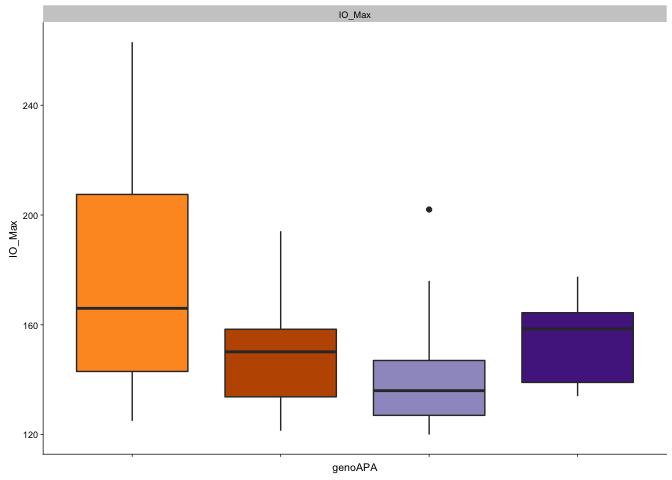
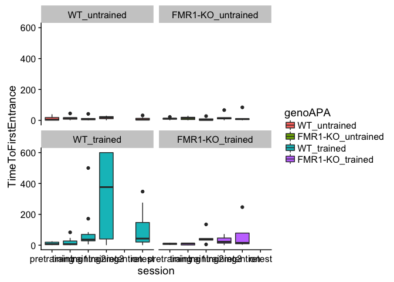

``` r
# Part 1: Reading and analyzing beahvior and physiology data

## load libraries -----
library(dplyr) ## for filtering and selecting rows
```

    ## 
    ## Attaching package: 'dplyr'

    ## The following objects are masked from 'package:stats':
    ## 
    ##     filter, lag

    ## The following objects are masked from 'package:base':
    ## 
    ##     intersect, setdiff, setequal, union

``` r
library(plyr) ## for renmaing factors
```

    ## -------------------------------------------------------------------------

    ## You have loaded plyr after dplyr - this is likely to cause problems.
    ## If you need functions from both plyr and dplyr, please load plyr first, then dplyr:
    ## library(plyr); library(dplyr)

    ## -------------------------------------------------------------------------

    ## 
    ## Attaching package: 'plyr'

    ## The following objects are masked from 'package:dplyr':
    ## 
    ##     arrange, count, desc, failwith, id, mutate, rename, summarise,
    ##     summarize

``` r
library(ggplot2) ## for awesome plots!
library(reshape2) #@ for melting dataframe
library(ggdendro) ## for dendrograms!!
library(cowplot) ## for easy modification to themes
```

    ## 
    ## Attaching package: 'cowplot'

    ## The following object is masked from 'package:ggplot2':
    ## 
    ##     ggsave

``` r
knitr::opts_chunk$set(fig.path = '../results/')
```

``` r
## color palettes
FentonPalette <- c('black','grey50','red','darkorange')
WTPalette <- c('black','red')
FMR1Palette <- c('grey50','darkorange')
colorvalAPA11 <-  c("WT" = "#bf5700", "FMR1-KO" = "#54278f", "FMR1-KO_trained" = "#ca0020","WT_trained" = "#ca0020",  "FMR1-KO_untrained" = "#404040","WT_untrained" = "#404040" )
colorvalgenoAPA <-  c("FMR1-KO_trained" = "#54278f","WT_trained" = "#bf5700",  "FMR1-KO_untrained" = "#9e9ac8","WT_untrained" = "#fe9929" ) 
colorvalgenoAPAfill <- c( "#fe9929" , "#bf5700",  "#9e9ac8", "#54278f")

## jitter points
dodge <- position_dodge(.3)
```

``` r
## wrangle the raw wt and fmr1 dataframes ----

## read the data 
wt <- read.csv("../data/01_WTbehavephys.csv", header=TRUE, stringsAsFactors = FALSE, na.strings = c("", "ND", "N/A"))
fmr1 <- read.csv("../data/01_FMR1behavephys.csv", header=TRUE, stringsAsFactors = FALSE, na.strings = c("", "ND", "N/A"))

## fixing columns both fmr1 and wt are as equivilent as possible
wt$filename <- as.character(paste(wt$filename, wt$X, sep="_")) ## mgerge 2 columns 

## delete obsolete columns
wt$X <- NULL 
wt$X.1 <- NULL
fmr1$X <- NULL
wt$next. <- NULL
fmr1$next. <- NULL
fmr1$PopSpike.max........mV. <- NA  ## add column
fmr1$PospSpike.Probability <- NA  ## add column
fmr1 <- fmr1[-c(75:80), ] ## removing rows
names(wt)
```

    ##  [1] "filename"                 "p.miss"                  
    ##  [3] "total"                    "total.1"                 
    ##  [5] "X..of"                    "time.to"                 
    ##  [7] "path.to"                  "speed"                   
    ##  [9] "entr."                    "X..of.1"                 
    ## [11] "time.to.1"                "path.to.1"               
    ## [13] "speed.1"                  "sd.of"                   
    ## [15] "line."                    "max."                    
    ## [17] "max..1"                   "time.to.2"               
    ## [19] "path.to.2"                "speed.2"                 
    ## [21] "Time"                     "pTime"                   
    ## [23] "pTime.1"                  "pTime.2"                 
    ## [25] "pTime.3"                  "Rayleig"                 
    ## [27] "Rayleig.1"                "Polar"                   
    ## [29] "Polar.1"                  "Polar.2"                 
    ## [31] "Polar.3"                  "Min"                     
    ## [33] "Min.1"                    "Polar.4"                 
    ## [35] "Polar.5"                  "Max"                     
    ## [37] "Max.1"                    "Annular"                 
    ## [39] "Annular.1"                "Annular.2"               
    ## [41] "Annular.3"                "Annular.4"               
    ## [43] "Annular.5"                "Annular.6"               
    ## [45] "Annular.7"                "mouse.id"                
    ## [47] "genotype"                 "group"                   
    ## [49] "LocomotorActivity"        "RECENT.LocomotorActivity"
    ## [51] "Punishment"               "Punishment.1"            
    ## [53] "Learning"                 "Memory"                  
    ## [55] "Memory.1"                 "SynapseFunction"         
    ## [57] "SynapsePlasticity"        "PopSpike.max........mV." 
    ## [59] "PospSpike.Probability"

``` r
names(fmr1)
```

    ##  [1] "filename"                 "p.miss"                  
    ##  [3] "total"                    "total.1"                 
    ##  [5] "X..of"                    "time.to"                 
    ##  [7] "path.to"                  "speed"                   
    ##  [9] "entr."                    "X..of.1"                 
    ## [11] "time.to.1"                "path.to.1"               
    ## [13] "speed.1"                  "sd.of"                   
    ## [15] "line."                    "max."                    
    ## [17] "max..1"                   "time.to.2"               
    ## [19] "path.to.2"                "speed.2"                 
    ## [21] "Time"                     "pTime"                   
    ## [23] "pTime.1"                  "pTime.2"                 
    ## [25] "pTime.3"                  "Rayleig"                 
    ## [27] "Rayleig.1"                "Polar"                   
    ## [29] "Polar.1"                  "Polar.2"                 
    ## [31] "Polar.3"                  "Min"                     
    ## [33] "Min.1"                    "Polar.4"                 
    ## [35] "Polar.5"                  "Max"                     
    ## [37] "Max.1"                    "Annular"                 
    ## [39] "Annular.1"                "Annular.2"               
    ## [41] "Annular.3"                "Annular.4"               
    ## [43] "Annular.5"                "Annular.6"               
    ## [45] "Annular.7"                "mouse.id"                
    ## [47] "genotype"                 "group"                   
    ## [49] "LocomotorActivity"        "RECENT.LocomotorActivity"
    ## [51] "Punishment"               "Punishment.1"            
    ## [53] "Learning"                 "Memory"                  
    ## [55] "Memory.1"                 "SynapseFunction"         
    ## [57] "SynapsePlasticity"        "PopSpike.max........mV." 
    ## [59] "PospSpike.Probability"

``` r
## create ind column with a animal name that matches qpcr (e.g "FMR1 AB" or "BL 19")
wt$ind <- wt$filename
head(wt$ind)
```

    ## [1] "               _NA"                  
    ## [2] "               _NA"                  
    ## [3] "               _NA"                  
    ## [4] "                 bl1D1Hab_Room_Train"
    ## [5] "              bl1D1Train1_Room_Train"
    ## [6] "              bl1D1Train2_Room_Train"

``` r
wt$ind <- gsub("[[:blank:]]*bl", "BL ", wt$ind) ##removed blank space then changes bl1... to BL 1...
wt$ind <- gsub("D[[:print:]]*", "", wt$ind) ## deletes the D (for Day) and everythign thereafter
wt$ind
```

    ##   [1] "               _NA" "               _NA" "               _NA"
    ##   [4] "BL 1"               "BL 1"               "BL 1"              
    ##   [7] "BL 1"               "BL 1"               "NA_NA"             
    ##  [10] "BL 2"               "BL 2"               "BL 2"              
    ##  [13] "BL 2"               "BL 2"               "NA_NA"             
    ##  [16] "BL 3"               "BL 3"               "BL 3"              
    ##  [19] "BL 3"               "BL 3"               "NA_NA"             
    ##  [22] "BL 4"               "BL 4"               "BL 4"              
    ##  [25] "BL 4"               "BL 4"               "NA_NA"             
    ##  [28] "BL 5"               "BL 5"               "BL 5"              
    ##  [31] "BL 5"               "BL 5"               "NA_NA"             
    ##  [34] "BL 6"               "BL 6"               "BL 6"              
    ##  [37] "BL 6"               "BL 6"               "NA_NA"             
    ##  [40] "BL 7"               "BL 7"               "BL 7"              
    ##  [43] "BL 7"               "BL 7"               "NA_NA"             
    ##  [46] "BL 8"               "BL 8"               "BL 8"              
    ##  [49] "BL 8"               "BL 8"               "NA_NA"             
    ##  [52] "BL 9"               "BL 9"               "BL 9"              
    ##  [55] "BL 9"               "BL 9"               "NA_NA"             
    ##  [58] "BL 10"              "BL 10"              "BL 10"             
    ##  [61] "BL 10"              "BL 10"              "NA_NA"             
    ##  [64] "BL 11"              "BL 11"              "BL 11"             
    ##  [67] "BL 11"              "BL 11"              "NA_NA"             
    ##  [70] "BL 12"              "BL 12"              "BL 12"             
    ##  [73] "BL 12"              "BL 12"              "NA_NA"             
    ##  [76] "BL 13"              "BL 13"              "BL 13"             
    ##  [79] "BL 13"              "BL 13"              "NA_NA"             
    ##  [82] "BL 14"              "BL 14"              "BL 14"             
    ##  [85] "BL 14"              "BL 14"              "NA_NA"             
    ##  [88] "BL 15"              "BL 15"              "BL 15"             
    ##  [91] "BL 15"              "BL 15"              "NA_NA"             
    ##  [94] "BL 16"              "BL 16"              "BL 16"             
    ##  [97] "BL 16"              "BL 16"              "NA_NA"             
    ## [100] "BL 17"              "BL 17"              "BL 17"             
    ## [103] "BL 17"              "BL 17"              "NA_NA"             
    ## [106] "BL 18"              "BL 18"              "BL 18"             
    ## [109] "BL 18"              "BL 18"              "NA_NA"             
    ## [112] "BL 19"              "BL 19"              "BL 19"             
    ## [115] "BL 19"              "BL 19"

``` r
fmr1$ind <- fmr1$filename
fmr1$ind <- gsub("RoomTrack_", "", fmr1$ind) ##remove RommTrack_"
fmr1$ind <- gsub("fmr1", "FMR1 ", fmr1$ind) ## changes to FMR1
fmr1$ind <- gsub("frm1", "FMR1 ", fmr1$ind) ## because one was typed wrong
fmr1$ind <- gsub("wildtype", "BL ", fmr1$ind) ## that one wildtype sample name
fmr1$ind <- gsub("_[ptr][[:print:]]*", "", fmr1$ind) ##deletes the rest of the filename
fmr1 <- filter(fmr1, !grepl("wildtypeA", filename ))  ## remove the 1 wildtype ind
fmr1$ind
```

    ##  [1] "               " "               " "               "
    ##  [4] "FMR1 AB"         "FMR1 AB"         "FMR1 AB"        
    ##  [7] "FMR1 AB"         "FMR1 AB"         NA               
    ## [10] "FMR1 A"          "FMR1 A"          "FMR1 A"         
    ## [13] "FMR1 A"          "FMR1 A"          NA               
    ## [16] "FMR1 B"          "FMR1 B"          "FMR1 B"         
    ## [19] "FMR1 B"          "FMR1 B"          NA               
    ## [22] "FMR1 C"          "FMR1 C"          "FMR1 C"         
    ## [25] "FMR1 C"          "FMR1 C"          NA               
    ## [28] "FMR1 E"          "FMR1 E"          "FMR1 E"         
    ## [31] "FMR1 E"          "FMR1 E"          NA               
    ## [34] "FMR1 F"          "FMR1 F"          "FMR1 F"         
    ## [37] "FMR1 F"          "FMR1 F"          NA               
    ## [40] "FMR1 G"          "FMR1 G"          "FMR1 G"         
    ## [43] "FMR1 G"          "FMR1 G"          NA               
    ## [46] "FMR1 H"          "FMR1 H"          "FMR1 H"         
    ## [49] "FMR1 H"          "FMR1 H"          NA               
    ## [52] "FMR1 I"          "FMR1 I"          "FMR1 I"         
    ## [55] "FMR1 I"          "FMR1 I"          NA               
    ## [58] "FMR1 J"          "FMR1 J"          "FMR1 J"         
    ## [61] "FMR1 J"          "FMR1 J"          NA               
    ## [64] "FMR1 K"          "FMR1 K"          "FMR1 K"         
    ## [67] "FMR1 K"          "FMR1 K"          NA

``` r
## rename columns
names(wt)[3] <- "TotalTime"
names(wt)[4] <- "TotalPath"
names(wt)[5] <- "Entrances"
names(wt)[6] <- "TimeToFirstEntrance"
names(wt)[7] <- "PathToFirstEntrance"
names(wt)[8] <- "SpeedToFirstEntrance"
names(wt)[9] <- "EntrancePerDistance"
names(wt)[10] <- "TotalShocks"
names(wt)[11] <- "TimeToFirstShock"
names(wt)[12] <- "PathToFirstShock"
names(wt)[13] <- "Speed"
names(wt)[14] <- "SDofSpeed"
names(wt)[15] <- "LineArity"
names(wt)[16] <- "MaxAvoidTime"
names(wt)[17] <- "MaxAvoidPath"
names(wt)[18] <- "TimeToSecondEntrance"
names(wt)[19] <- "PathToSecondEntrance"
names(wt)[20] <- "SpeedToSecondEntranc"
names(wt)[21] <- "TimeTARG"
names(wt)[22] <- "pTimeTARG"
names(wt)[23] <- "pTimeCCW"
names(wt)[24] <- "pTimeOPP"
names(wt)[25] <- "pTimeCW"
names(wt)[26] <- "RayleigLength"
names(wt)[27] <- "RayleigAngle"
names(wt)[28] <- "PolarAveVal"
names(wt)[29] <- "PolarSdVal"
names(wt)[30] <- "PolarMinVal"
names(wt)[31] <- "PolarMinBin"
names(wt)[32] <- "MinLoBin"
names(wt)[33] <- "MinHiBin"
names(wt)[34] <- "PolarMaxVal"
names(wt)[35] <- "PolarMaxBin"
names(wt)[36] <- "MaxLoBin"
names(wt)[37] <- "MaxHiBin"
names(wt)[38] <- "AnnularMinVal"
names(wt)[39] <- "AnnularMinBin"
names(wt)[40] <- "AnnularMaxVal"
names(wt)[41] <- "AnnularMaxBin"
names(wt)[42] <- "AnnularAvg"
names(wt)[43] <- "AnnularSD"
names(wt)[44] <- "AnnularSkewnes"
names(wt)[45] <- "AnnularKurtosis"
names(wt)[46] <- "ind_bad"
names(wt)[47] <- "genotype_bad"
names(wt)[48] <- "APA"
names(wt)[49] <- "TotalLocomotorActivity"
names(wt)[50] <- "LastLocomotorActivity"
names(wt)[51] <- "TotalPunishment"
names(wt)[53] <- "LastPunishment"
names(wt)[54] <- "LastTotalEntrances"
names(wt)[55] <- "T1Retention"
names(wt)[56] <- "T2Retention"
names(wt)[57] <- "IO_Max"
names(wt)[58] <- "LTP_Baseline"
names(wt)[59] <- "LTP_Baseline_SD"
names(wt) # check all good
```

    ##  [1] "filename"               "p.miss"                
    ##  [3] "TotalTime"              "TotalPath"             
    ##  [5] "Entrances"              "TimeToFirstEntrance"   
    ##  [7] "PathToFirstEntrance"    "SpeedToFirstEntrance"  
    ##  [9] "EntrancePerDistance"    "TotalShocks"           
    ## [11] "TimeToFirstShock"       "PathToFirstShock"      
    ## [13] "Speed"                  "SDofSpeed"             
    ## [15] "LineArity"              "MaxAvoidTime"          
    ## [17] "MaxAvoidPath"           "TimeToSecondEntrance"  
    ## [19] "PathToSecondEntrance"   "SpeedToSecondEntranc"  
    ## [21] "TimeTARG"               "pTimeTARG"             
    ## [23] "pTimeCCW"               "pTimeOPP"              
    ## [25] "pTimeCW"                "RayleigLength"         
    ## [27] "RayleigAngle"           "PolarAveVal"           
    ## [29] "PolarSdVal"             "PolarMinVal"           
    ## [31] "PolarMinBin"            "MinLoBin"              
    ## [33] "MinHiBin"               "PolarMaxVal"           
    ## [35] "PolarMaxBin"            "MaxLoBin"              
    ## [37] "MaxHiBin"               "AnnularMinVal"         
    ## [39] "AnnularMinBin"          "AnnularMaxVal"         
    ## [41] "AnnularMaxBin"          "AnnularAvg"            
    ## [43] "AnnularSD"              "AnnularSkewnes"        
    ## [45] "AnnularKurtosis"        "ind_bad"               
    ## [47] "genotype_bad"           "APA"                   
    ## [49] "TotalLocomotorActivity" "LastLocomotorActivity" 
    ## [51] "TotalPunishment"        "Punishment.1"          
    ## [53] "LastPunishment"         "LastTotalEntrances"    
    ## [55] "T1Retention"            "T2Retention"           
    ## [57] "IO_Max"                 "LTP_Baseline"          
    ## [59] "LTP_Baseline_SD"        "ind"

``` r
## do same for fmr1
names(fmr1)[3] <- "TotalTime"
names(fmr1)[4] <- "TotalPath"
names(fmr1)[5] <- "Entrances"
names(fmr1)[6] <- "TimeToFirstEntrance"
names(fmr1)[7] <- "PathToFirstEntrance"
names(fmr1)[8] <- "SpeedToFirstEntrance"
names(fmr1)[9] <- "EntrancePerDistance"
names(fmr1)[10] <- "TotalShocks"
names(fmr1)[11] <- "TimeToFirstShock"
names(fmr1)[12] <- "PathToFirstShock"
names(fmr1)[13] <- "Speed"
names(fmr1)[14] <- "SDofSpeed"
names(fmr1)[15] <- "LineArity"
names(fmr1)[16] <- "MaxAvoidTime"
names(fmr1)[17] <- "MaxAvoidPath"
names(fmr1)[18] <- "TimeToSecondEntrance"
names(fmr1)[19] <- "PathToSecondEntrance"
names(fmr1)[20] <- "SpeedToSecondEntranc"
names(fmr1)[21] <- "TimeTARG"
names(fmr1)[22] <- "pTimeTARG"
names(fmr1)[23] <- "pTimeCCW"
names(fmr1)[24] <- "pTimeOPP"
names(fmr1)[25] <- "pTimeCW"
names(fmr1)[26] <- "RayleigLength"
names(fmr1)[27] <- "RayleigAngle"
names(fmr1)[28] <- "PolarAveVal"
names(fmr1)[29] <- "PolarSdVal"
names(fmr1)[30] <- "PolarMinVal"
names(fmr1)[31] <- "PolarMinBin"
names(fmr1)[32] <- "MinLoBin"
names(fmr1)[33] <- "MinHiBin"
names(fmr1)[34] <- "PolarMaxVal"
names(fmr1)[35] <- "PolarMaxBin"
names(fmr1)[36] <- "MaxLoBin"
names(fmr1)[37] <- "MaxHiBin"
names(fmr1)[38] <- "AnnularMinVal"
names(fmr1)[39] <- "AnnularMinBin"
names(fmr1)[40] <- "AnnularMaxVal"
names(fmr1)[41] <- "AnnularMaxBin"
names(fmr1)[42] <- "AnnularAvg"
names(fmr1)[43] <- "AnnularSD"
names(fmr1)[44] <- "AnnularSkewnes"
names(fmr1)[45] <- "AnnularKurtosis"
names(fmr1)[46] <- "ind_bad"
names(fmr1)[47] <- "genotype_bad"
names(fmr1)[48] <- "APA"
names(fmr1)[49] <- "TotalLocomotorActivity"
names(fmr1)[50] <- "LastLocomotorActivity"
names(fmr1)[51] <- "TotalPunishment"
names(fmr1)[53] <- "LastPunishment"
names(fmr1)[54] <- "LastTotalEntrances"
names(fmr1)[55] <- "T1Retention"
names(fmr1)[56] <- "T2Retention"
names(fmr1)[57] <- "IO_Max"
names(fmr1)[58] <- "LTP_Baseline"
names(fmr1)[59] <- "LTP_Baseline_SD"

## add columns genotype (easier for wt df than for fmr1 df)
wt$genotype <- as.factor("WT")
fmr1$genotype <- ifelse(grepl("fmr1|frm1",fmr1$filename),'FMR1-KO','WT')
fmr1$genotype <- as.factor(fmr1$genotype)

## binding, clearning, filtering, renaming, adding conditions ----

wtfmr1 <- rbind(wt, fmr1) ## combine the datasets into one
wtfmr1 <- filter(wtfmr1, grepl("Room", filename)) ## remove non-data rows
str(wtfmr1)
```

    ## 'data.frame':    150 obs. of  61 variables:
    ##  $ filename              : chr  "                 bl1D1Hab_Room_Train" "              bl1D1Train1_Room_Train" "              bl1D1Train2_Room_Train" "              bl1D1Train3_Room_Train" ...
    ##  $ p.miss                : num  0 0 0 0 0.0525 0 0.00072 0 0.0315 0.00883 ...
    ##  $ TotalTime             : chr  "600" "600" "600" "600" ...
    ##  $ TotalPath             : chr  "28.21" "17.64" "16.86" "15.53" ...
    ##  $ Entrances             : chr  "32" "8" "3" "2" ...
    ##  $ TimeToFirstEntrance   : chr  "1.5" "27.77" "32.03" "22.33" ...
    ##  $ PathToFirstEntrance   : chr  "0.11" "1.19" "0.57" "0.41" ...
    ##  $ SpeedToFirstEntrance  : chr  "13.11" "9.02" "1.88" "1.56" ...
    ##  $ EntrancePerDistance   : chr  "1.13" "0.45" "0.18" "0.13" ...
    ##  $ TotalShocks           : chr  "81" "8" "3" "2" ...
    ##  $ TimeToFirstShock      : chr  "1.5" "27.77" "32.03" "22.33" ...
    ##  $ PathToFirstShock      : chr  "0.11" "1.19" "0.57" "0.41" ...
    ##  $ Speed                 : chr  "4.7" "2.94" "2.81" "2.59" ...
    ##  $ SDofSpeed             : chr  "3.67" "2.9" "2.75" "2.62" ...
    ##  $ LineArity             : chr  "0.624" "0.6925" "0.6699" "0.6563" ...
    ##  $ MaxAvoidTime          : chr  "52" "180" "541" "560" ...
    ##  $ MaxAvoidPath          : chr  "2.15" "4.73" "14.98" "0.41" ...
    ##  $ TimeToSecondEntrance  : chr  "21.97" "67.4" "53.53" "39.53" ...
    ##  $ PathToSecondEntrance  : chr  "1.22" "2.15" "1.22" "0.93" ...
    ##  $ SpeedToSecondEntranc  : chr  "8.11" "1.91" "2.04" "1.69" ...
    ##  $ TimeTARG              : chr  "152.865" "6.633" "2.431" "1.6" ...
    ##  $ pTimeTARG             : chr  "0.3681" "0.0165" "0.0066" "0.0041" ...
    ##  $ pTimeCCW              : chr  "0.2256" "0.2127" "0.1592" "0.1551" ...
    ##  $ pTimeOPP              : chr  "0.1051" "0.5037" "0.4673" "0.5646" ...
    ##  $ pTimeCW               : chr  "0.3012" "0.2671" "0.367" "0.2762" ...
    ##  $ RayleigLength         : chr  "0.25" "0.5" "0.56" "0.65" ...
    ##  $ RayleigAngle          : chr  "339.62" "195.41" "204.06" "198.65" ...
    ##  $ PolarAveVal           : chr  "152.56" "248.34" "256.34" "274.63" ...
    ##  $ PolarSdVal            : chr  "101.95" "72.05" "68.24" "54.9" ...
    ##  $ PolarMinVal           : chr  "0.0087" "0.0006" "0" "0" ...
    ##  $ PolarMinBin           : chr  "190" "0" "0" "340" ...
    ##  $ MinLoBin              : chr  "0" "240" "250" "240" ...
    ##  $ MinHiBin              : chr  "250" "180" "190" "190" ...
    ##  $ PolarMaxVal           : chr  "0.0546" "0.0802" "0.0879" "0.0849" ...
    ##  $ PolarMaxBin           : chr  "330" "200" "230" "220" ...
    ##  $ MaxLoBin              : chr  "250" "160" "180" "170" ...
    ##  $ MaxHiBin              : chr  "30" "250" "270" "250" ...
    ##  $ AnnularMinVal         : chr  "0.0121" "0.006" "0.0013" "0.0015" ...
    ##  $ AnnularMinBin         : chr  "19.4" "3.5" "3.5" "3.5" ...
    ##  $ AnnularMaxVal         : chr  "0.4487" "0.4759" "0.5119" "0.4852" ...
    ##  $ AnnularMaxBin         : chr  "16.6" "16.6" "18" "18" ...
    ##  $ AnnularAvg            : chr  "15.7" "16.74" "17.17" "17" ...
    ##  $ AnnularSD             : chr  "14.57" "11.28" "8.06" "9.18" ...
    ##  $ AnnularSkewnes        : chr  "2.1" "4.26" "2.88" "2.84" ...
    ##  $ AnnularKurtosis       : chr  "9.29" "31.51" "21.98" "17.08" ...
    ##  $ ind_bad               : chr  NA NA NA NA ...
    ##  $ genotype_bad          : chr  NA NA NA NA ...
    ##  $ APA                   : chr  NA NA NA NA ...
    ##  $ TotalLocomotorActivity: chr  NA NA NA NA ...
    ##  $ LastLocomotorActivity : chr  NA NA NA NA ...
    ##  $ TotalPunishment       : chr  NA NA NA NA ...
    ##  $ Punishment.1          : chr  NA NA NA NA ...
    ##  $ LastPunishment        : chr  NA NA NA NA ...
    ##  $ LastTotalEntrances    : chr  NA NA NA NA ...
    ##  $ T1Retention           : chr  NA NA NA NA ...
    ##  $ T2Retention           : chr  NA NA NA NA ...
    ##  $ IO_Max                : chr  NA NA NA NA ...
    ##  $ LTP_Baseline          : num  NA NA NA NA 0 NA NA NA NA 9.3 ...
    ##  $ LTP_Baseline_SD       : int  NA NA NA NA 0 NA NA NA NA 1 ...
    ##  $ ind                   : chr  "BL 1" "BL 1" "BL 1" "BL 1" ...
    ##  $ genotype              : Factor w/ 2 levels "WT","FMR1-KO": 1 1 1 1 1 1 1 1 1 1 ...

``` r
## making strings factors
wtfmr1$ind <- as.factor(wtfmr1$ind)  
wtfmr1$APA <- as.factor(wtfmr1$APA) 

## making a bunch of columns numeric
wtfmr1[, c(3:45, 49:56, 58:59)] <- sapply(wtfmr1[, c(3:45, 49:56, 58:59)], as.numeric)
str(wtfmr1)
```

    ## 'data.frame':    150 obs. of  61 variables:
    ##  $ filename              : chr  "                 bl1D1Hab_Room_Train" "              bl1D1Train1_Room_Train" "              bl1D1Train2_Room_Train" "              bl1D1Train3_Room_Train" ...
    ##  $ p.miss                : num  0 0 0 0 0.0525 0 0.00072 0 0.0315 0.00883 ...
    ##  $ TotalTime             : num  600 600 600 600 600 600 600 600 600 600 ...
    ##  $ TotalPath             : num  28.2 17.6 16.9 15.5 20.2 ...
    ##  $ Entrances             : num  32 8 3 2 2 35 4 4 1 4 ...
    ##  $ TimeToFirstEntrance   : num  1.5 27.8 32 22.3 131.6 ...
    ##  $ PathToFirstEntrance   : num  0.11 1.19 0.57 0.41 5.71 0.45 0 0.76 0.44 0.35 ...
    ##  $ SpeedToFirstEntrance  : num  13.11 9.02 1.88 1.56 8.35 ...
    ##  $ EntrancePerDistance   : num  1.13 0.45 0.18 0.13 0.1 1.18 0.2 0.22 0.06 0.17 ...
    ##  $ TotalShocks           : num  81 8 3 2 2 59 4 4 1 4 ...
    ##  $ TimeToFirstShock      : num  1.5 27.8 32 22.3 131.6 ...
    ##  $ PathToFirstShock      : num  0.11 1.19 0.57 0.41 5.71 0.45 0 0.76 0.44 0.35 ...
    ##  $ Speed                 : num  4.7 2.94 2.81 2.59 3.36 4.93 3.3 3 2.9 3.94 ...
    ##  $ SDofSpeed             : num  3.67 2.9 2.75 2.62 3.17 3.73 2.84 2.74 2.32 3.44 ...
    ##  $ LineArity             : num  0.624 0.693 0.67 0.656 0.448 ...
    ##  $ MaxAvoidTime          : num  52 180 541 560 295 61 417 348 568 334 ...
    ##  $ MaxAvoidPath          : num  2.15 4.73 14.98 0.41 7.49 ...
    ##  $ TimeToSecondEntrance  : num  22 67.4 53.5 39.5 304.8 ...
    ##  $ PathToSecondEntrance  : num  1.22 2.15 1.22 0.93 12.14 ...
    ##  $ SpeedToSecondEntranc  : num  8.11 1.91 2.04 1.69 10.42 ...
    ##  $ TimeTARG              : num  152.87 6.63 2.43 1.6 8.73 ...
    ##  $ pTimeTARG             : num  0.3681 0.0165 0.0066 0.0041 0.0235 ...
    ##  $ pTimeCCW              : num  0.2256 0.2127 0.1592 0.1551 0.0322 ...
    ##  $ pTimeOPP              : num  0.105 0.504 0.467 0.565 0.55 ...
    ##  $ pTimeCW               : num  0.301 0.267 0.367 0.276 0.394 ...
    ##  $ RayleigLength         : num  0.25 0.5 0.56 0.65 0.69 0.09 0.49 0.65 0.62 0.62 ...
    ##  $ RayleigAngle          : num  340 195 204 199 219 ...
    ##  $ PolarAveVal           : num  153 248 256 275 256 ...
    ##  $ PolarSdVal            : num  102 72 68.2 54.9 71.4 ...
    ##  $ PolarMinVal           : num  0.0087 0.0006 0 0 0.0005 0.0142 0.0002 0 0 0.0002 ...
    ##  $ PolarMinBin           : num  190 0 0 340 40 70 0 0 0 0 ...
    ##  $ MinLoBin              : num  0 240 250 240 240 350 170 230 220 140 ...
    ##  $ MinHiBin              : num  250 180 190 190 190 210 90 190 160 80 ...
    ##  $ PolarMaxVal           : num  0.0546 0.0802 0.0879 0.0849 0.111 0.0468 0.0714 0.0936 0.0752 0.0772 ...
    ##  $ PolarMaxBin           : num  330 200 230 220 230 220 110 230 190 140 ...
    ##  $ MaxLoBin              : num  250 160 180 170 170 130 70 180 150 70 ...
    ##  $ MaxHiBin              : num  30 250 270 250 250 310 180 250 240 160 ...
    ##  $ AnnularMinVal         : num  0.0121 0.006 0.0013 0.0015 0.0046 0.0015 0.0003 0.0018 0.001 0.0007 ...
    ##  $ AnnularMinBin         : num  19.4 3.5 3.5 3.5 3.5 19.4 19.4 3.5 8.5 19.4 ...
    ##  $ AnnularMaxVal         : num  0.449 0.476 0.512 0.485 0.449 ...
    ##  $ AnnularMaxBin         : num  16.6 16.6 18 18 16.6 15 15 16.6 16.6 16.6 ...
    ##  $ AnnularAvg            : num  15.7 16.7 17.2 17 16.6 ...
    ##  $ AnnularSD             : num  14.57 11.28 8.06 9.18 11.74 ...
    ##  $ AnnularSkewnes        : num  2.1 4.26 2.88 2.84 2.6 1.67 1.61 1.57 1.49 2.5 ...
    ##  $ AnnularKurtosis       : num  9.29 31.51 21.98 17.08 15.71 ...
    ##  $ ind_bad               : chr  NA NA NA NA ...
    ##  $ genotype_bad          : chr  NA NA NA NA ...
    ##  $ APA                   : Factor w/ 2 levels "trained","untrained": NA NA NA NA 1 NA NA NA NA 1 ...
    ##  $ TotalLocomotorActivity: num  NA NA NA NA 98.4 ...
    ##  $ LastLocomotorActivity : num  NA NA NA NA 20.2 ...
    ##  $ TotalPunishment       : num  NA NA NA NA 15 NA NA NA NA 13 ...
    ##  $ Punishment.1          : num  NA NA NA NA 2 NA NA NA NA 4 ...
    ##  $ LastPunishment        : num  NA NA NA NA 15 NA NA NA NA 13 ...
    ##  $ LastTotalEntrances    : num  NA NA NA NA 132 ...
    ##  $ T1Retention           : num  NA NA NA NA 305 ...
    ##  $ T2Retention           : num  NA NA NA NA 12 NA NA NA NA 9.8 ...
    ##  $ IO_Max                : chr  NA NA NA NA ...
    ##  $ LTP_Baseline          : num  NA NA NA NA 0 NA NA NA NA 9.3 ...
    ##  $ LTP_Baseline_SD       : num  NA NA NA NA 0 NA NA NA NA 1 ...
    ##  $ ind                   : Factor w/ 30 levels "BL 1","BL 10",..: 1 1 1 1 1 12 12 12 12 12 ...
    ##  $ genotype              : Factor w/ 2 levels "WT","FMR1-KO": 1 1 1 1 1 1 1 1 1 1 ...

``` r
## add column session with APA information
wtfmr1$session <- ifelse(grepl("pretraining|pretrain|Hab", wtfmr1$filename), "pretraining", 
                     ifelse(grepl("training1|Train1", wtfmr1$filename), "training1",
                            ifelse(grepl("training2|Train2", wtfmr1$filename), "training2",
                                   ifelse(grepl("training3|Train3", wtfmr1$filename), "training3",
                                          ifelse(grepl("retention|reten", wtfmr1$filename), "retention", 
                                                 ifelse(grepl("Retest", wtfmr1$filename), "retest", "NA"))))))

wtfmr1$session  ## check that all names good with no NAs                                 
```

    ##   [1] "pretraining" "training1"   "training2"   "training3"   "retest"     
    ##   [6] "pretraining" "training1"   "training2"   "training3"   "retest"     
    ##  [11] "pretraining" "training1"   "training2"   "training3"   "retest"     
    ##  [16] "pretraining" "training1"   "training2"   "training3"   "retest"     
    ##  [21] "pretraining" "training1"   "training2"   "training3"   "retest"     
    ##  [26] "pretraining" "training1"   "training2"   "training3"   "retest"     
    ##  [31] "pretraining" "training1"   "training2"   "training3"   "retest"     
    ##  [36] "pretraining" "training1"   "training2"   "training3"   "retest"     
    ##  [41] "pretraining" "training1"   "training2"   "training3"   "retest"     
    ##  [46] "pretraining" "training1"   "training2"   "training3"   "retest"     
    ##  [51] "pretraining" "training1"   "training2"   "training3"   "retest"     
    ##  [56] "pretraining" "training1"   "training2"   "training3"   "retest"     
    ##  [61] "pretraining" "training1"   "training2"   "training3"   "retest"     
    ##  [66] "pretraining" "training1"   "training2"   "training3"   "retest"     
    ##  [71] "pretraining" "training1"   "training2"   "training3"   "retest"     
    ##  [76] "pretraining" "training1"   "training2"   "training3"   "retest"     
    ##  [81] "pretraining" "training1"   "training2"   "training3"   "retest"     
    ##  [86] "pretraining" "training1"   "training2"   "training3"   "retest"     
    ##  [91] "pretraining" "training1"   "training2"   "training3"   "retest"     
    ##  [96] "pretraining" "training1"   "training2"   "training3"   "retention"  
    ## [101] "pretraining" "training1"   "training2"   "training3"   "retention"  
    ## [106] "pretraining" "training1"   "training2"   "training3"   "retention"  
    ## [111] "pretraining" "training1"   "training2"   "training3"   "retention"  
    ## [116] "pretraining" "training1"   "training2"   "training3"   "retention"  
    ## [121] "pretraining" "training1"   "training2"   "training3"   "retention"  
    ## [126] "pretraining" "training1"   "training2"   "training3"   "retention"  
    ## [131] "pretraining" "training1"   "training2"   "training3"   "retention"  
    ## [136] "pretraining" "training1"   "training2"   "training3"   "retention"  
    ## [141] "pretraining" "training1"   "training2"   "training3"   "retention"  
    ## [146] "pretraining" "training1"   "training2"   "training3"   "retention"

``` r
wtfmr1$session <- as.factor(wtfmr1$session)  
wtfmr1$session <- factor(wtfmr1$session, levels = c("pretraining", "training1", "training2", "training3", "retention", "retest"))

### separate out the summary columns and clean up / wrangle ----
summary <- filter(wtfmr1, session %in% c("retention", "retest"))
summary <- summary[c(60:61,48,62,49:59,1)] #select and reorder columns, so animal first
names(summary)
```

    ##  [1] "ind"                    "genotype"              
    ##  [3] "APA"                    "session"               
    ##  [5] "TotalLocomotorActivity" "LastLocomotorActivity" 
    ##  [7] "TotalPunishment"        "Punishment.1"          
    ##  [9] "LastPunishment"         "LastTotalEntrances"    
    ## [11] "T1Retention"            "T2Retention"           
    ## [13] "IO_Max"                 "LTP_Baseline"          
    ## [15] "LTP_Baseline_SD"        "filename"

``` r
str(summary)
```

    ## 'data.frame':    30 obs. of  16 variables:
    ##  $ ind                   : Factor w/ 30 levels "BL 1","BL 10",..: 1 12 13 14 15 16 17 18 19 2 ...
    ##  $ genotype              : Factor w/ 2 levels "WT","FMR1-KO": 1 1 1 1 1 1 1 1 1 1 ...
    ##  $ APA                   : Factor w/ 2 levels "trained","untrained": 1 1 1 2 1 2 1 2 1 2 ...
    ##  $ session               : Factor w/ 6 levels "pretraining",..: 6 6 6 6 6 6 6 6 6 6 ...
    ##  $ TotalLocomotorActivity: num  98.4 108.4 97.9 109.3 97.4 ...
    ##  $ LastLocomotorActivity : num  20.2 23.6 15.4 24 16.3 ...
    ##  $ TotalPunishment       : num  15 13 6 0 21 0 10 0 9 0 ...
    ##  $ Punishment.1          : num  2 4 1 0 3 0 5 0 2 0 ...
    ##  $ LastPunishment        : num  15 13 6 85 17 56 10 83 9 82 ...
    ##  $ LastTotalEntrances    : num  131.57 6.83 162.9 4.73 58.57 ...
    ##  $ T1Retention           : num  304.8 94.9 600 18.5 331.2 ...
    ##  $ T2Retention           : num  12 9.8 4 2.4 2.6 2.1 5.8 6.5 13 3.8 ...
    ##  $ IO_Max                : chr  "130.0%" "127.0%" "136.0%" "212.0%" ...
    ##  $ LTP_Baseline          : num  0 9.3 3.7 NA 0 NA 5.9 0 26 0 ...
    ##  $ LTP_Baseline_SD       : num  0 1 1 NA 0 NA 1 0 1 0 ...
    ##  $ filename              : chr  "              bl1D2Retest_Room_Train" "              bl2D2Retest_Room_Train" "              bl3D2Retest_Room_Train" "              bl4D2Retest_Room_Control" ...

``` r
## rename APA to match qpcr data
#summary$APA <- revalue(summary$APA, c("untrained" = "control"))  # using "untrained" is more informative than control
summary$APA <- factor(summary$APA, levels = c("untrained", "trained"))
summary$APA
```

    ##  [1] trained   trained   trained   untrained trained   untrained trained  
    ##  [8] untrained trained   untrained trained   untrained trained   untrained
    ## [15] trained   untrained trained   untrained trained   untrained untrained
    ## [22] trained   trained   untrained trained   untrained trained   untrained
    ## [29] trained   untrained
    ## Levels: untrained trained

``` r
## making a bunch of columns numeric
summary$IO_Max <- gsub("%", "", summary$IO_Max) #remove the percent sign
summary[, c(5:15)] <- sapply(summary[, c(5:15)], as.numeric)

## create genoAPA column
summary$genoAPA <- summary$genoAPA <- as.factor(paste(summary$genotype,summary$APA, sep="_"))
summary$genoAPA <- factor(summary$genoAPA, levels = c("WT_untrained", "FMR1-KO_untrained", "WT_trained", "FMR1-KO_trained"))
summary$genoAPA
```

    ##  [1] WT_trained        WT_trained        WT_trained       
    ##  [4] WT_untrained      WT_trained        WT_untrained     
    ##  [7] WT_trained        WT_untrained      WT_trained       
    ## [10] WT_untrained      WT_trained        WT_untrained     
    ## [13] WT_trained        WT_untrained      WT_trained       
    ## [16] WT_untrained      WT_trained        WT_untrained     
    ## [19] WT_trained        FMR1-KO_untrained FMR1-KO_untrained
    ## [22] FMR1-KO_trained   FMR1-KO_trained   FMR1-KO_untrained
    ## [25] FMR1-KO_trained   FMR1-KO_untrained FMR1-KO_trained  
    ## [28] FMR1-KO_untrained FMR1-KO_trained   FMR1-KO_untrained
    ## Levels: WT_untrained FMR1-KO_untrained WT_trained FMR1-KO_trained

``` r
head(summary)
```

    ##    ind genotype       APA session TotalLocomotorActivity
    ## 1 BL 1       WT   trained  retest                  98.40
    ## 2 BL 2       WT   trained  retest                 108.41
    ## 3 BL 3       WT   trained  retest                  97.90
    ## 4 BL 4       WT untrained  retest                 109.33
    ## 5 BL 5       WT   trained  retest                  97.36
    ## 6 BL 6       WT untrained  retest                 113.41
    ##   LastLocomotorActivity TotalPunishment Punishment.1 LastPunishment
    ## 1                 20.16              15            2             15
    ## 2                 23.62              13            4             13
    ## 3                 15.43               6            1              6
    ## 4                 24.00               0            0             85
    ## 5                 16.30              21            3             17
    ## 6                 17.01               0            0             56
    ##   LastTotalEntrances T1Retention T2Retention IO_Max LTP_Baseline
    ## 1             131.57      304.80        12.0    130          0.0
    ## 2               6.83       94.93         9.8    127          9.3
    ## 3             162.90      599.97         4.0    136          3.7
    ## 4               4.73       18.53         2.4    212           NA
    ## 5              58.57      331.20         2.6    125          0.0
    ## 6              10.83       36.07         2.1    203           NA
    ##   LTP_Baseline_SD                               filename      genoAPA
    ## 1               0                 bl1D2Retest_Room_Train   WT_trained
    ## 2               1                 bl2D2Retest_Room_Train   WT_trained
    ## 3               1                 bl3D2Retest_Room_Train   WT_trained
    ## 4              NA               bl4D2Retest_Room_Control WT_untrained
    ## 5               0                 bl5D2Retest_Room_Train   WT_trained
    ## 6              NA               bl6D2Retest_Room_Control WT_untrained

``` r
summary_long <- melt(summary, id=c("ind","genotype", "APA", "session", "filename", "genoAPA"))
summary_long$value <- as.numeric(summary_long$value)
str(summary_long)
```

    ## 'data.frame':    330 obs. of  8 variables:
    ##  $ ind     : Factor w/ 30 levels "BL 1","BL 10",..: 1 12 13 14 15 16 17 18 19 2 ...
    ##  $ genotype: Factor w/ 2 levels "WT","FMR1-KO": 1 1 1 1 1 1 1 1 1 1 ...
    ##  $ APA     : Factor w/ 2 levels "untrained","trained": 2 2 2 1 2 1 2 1 2 1 ...
    ##  $ session : Factor w/ 6 levels "pretraining",..: 6 6 6 6 6 6 6 6 6 6 ...
    ##  $ filename: chr  "              bl1D2Retest_Room_Train" "              bl2D2Retest_Room_Train" "              bl3D2Retest_Room_Train" "              bl4D2Retest_Room_Control" ...
    ##  $ genoAPA : Factor w/ 4 levels "WT_untrained",..: 3 3 3 1 3 1 3 1 3 1 ...
    ##  $ variable: Factor w/ 11 levels "TotalLocomotorActivity",..: 1 1 1 1 1 1 1 1 1 1 ...
    ##  $ value   : num  98.4 108.4 97.9 109.3 97.4 ...

``` r
levels(summary_long$genoAPA)
```

    ## [1] "WT_untrained"      "FMR1-KO_untrained" "WT_trained"       
    ## [4] "FMR1-KO_trained"

``` r
levels(summary_long$genoAPA) <- c("WT_untrained" ,"WT_trained"  , "FMR1-KO_untrained","FMR1-KO_trained" )


### improve indiviual session dataframe ----
str(wtfmr1)
```

    ## 'data.frame':    150 obs. of  62 variables:
    ##  $ filename              : chr  "                 bl1D1Hab_Room_Train" "              bl1D1Train1_Room_Train" "              bl1D1Train2_Room_Train" "              bl1D1Train3_Room_Train" ...
    ##  $ p.miss                : num  0 0 0 0 0.0525 0 0.00072 0 0.0315 0.00883 ...
    ##  $ TotalTime             : num  600 600 600 600 600 600 600 600 600 600 ...
    ##  $ TotalPath             : num  28.2 17.6 16.9 15.5 20.2 ...
    ##  $ Entrances             : num  32 8 3 2 2 35 4 4 1 4 ...
    ##  $ TimeToFirstEntrance   : num  1.5 27.8 32 22.3 131.6 ...
    ##  $ PathToFirstEntrance   : num  0.11 1.19 0.57 0.41 5.71 0.45 0 0.76 0.44 0.35 ...
    ##  $ SpeedToFirstEntrance  : num  13.11 9.02 1.88 1.56 8.35 ...
    ##  $ EntrancePerDistance   : num  1.13 0.45 0.18 0.13 0.1 1.18 0.2 0.22 0.06 0.17 ...
    ##  $ TotalShocks           : num  81 8 3 2 2 59 4 4 1 4 ...
    ##  $ TimeToFirstShock      : num  1.5 27.8 32 22.3 131.6 ...
    ##  $ PathToFirstShock      : num  0.11 1.19 0.57 0.41 5.71 0.45 0 0.76 0.44 0.35 ...
    ##  $ Speed                 : num  4.7 2.94 2.81 2.59 3.36 4.93 3.3 3 2.9 3.94 ...
    ##  $ SDofSpeed             : num  3.67 2.9 2.75 2.62 3.17 3.73 2.84 2.74 2.32 3.44 ...
    ##  $ LineArity             : num  0.624 0.693 0.67 0.656 0.448 ...
    ##  $ MaxAvoidTime          : num  52 180 541 560 295 61 417 348 568 334 ...
    ##  $ MaxAvoidPath          : num  2.15 4.73 14.98 0.41 7.49 ...
    ##  $ TimeToSecondEntrance  : num  22 67.4 53.5 39.5 304.8 ...
    ##  $ PathToSecondEntrance  : num  1.22 2.15 1.22 0.93 12.14 ...
    ##  $ SpeedToSecondEntranc  : num  8.11 1.91 2.04 1.69 10.42 ...
    ##  $ TimeTARG              : num  152.87 6.63 2.43 1.6 8.73 ...
    ##  $ pTimeTARG             : num  0.3681 0.0165 0.0066 0.0041 0.0235 ...
    ##  $ pTimeCCW              : num  0.2256 0.2127 0.1592 0.1551 0.0322 ...
    ##  $ pTimeOPP              : num  0.105 0.504 0.467 0.565 0.55 ...
    ##  $ pTimeCW               : num  0.301 0.267 0.367 0.276 0.394 ...
    ##  $ RayleigLength         : num  0.25 0.5 0.56 0.65 0.69 0.09 0.49 0.65 0.62 0.62 ...
    ##  $ RayleigAngle          : num  340 195 204 199 219 ...
    ##  $ PolarAveVal           : num  153 248 256 275 256 ...
    ##  $ PolarSdVal            : num  102 72 68.2 54.9 71.4 ...
    ##  $ PolarMinVal           : num  0.0087 0.0006 0 0 0.0005 0.0142 0.0002 0 0 0.0002 ...
    ##  $ PolarMinBin           : num  190 0 0 340 40 70 0 0 0 0 ...
    ##  $ MinLoBin              : num  0 240 250 240 240 350 170 230 220 140 ...
    ##  $ MinHiBin              : num  250 180 190 190 190 210 90 190 160 80 ...
    ##  $ PolarMaxVal           : num  0.0546 0.0802 0.0879 0.0849 0.111 0.0468 0.0714 0.0936 0.0752 0.0772 ...
    ##  $ PolarMaxBin           : num  330 200 230 220 230 220 110 230 190 140 ...
    ##  $ MaxLoBin              : num  250 160 180 170 170 130 70 180 150 70 ...
    ##  $ MaxHiBin              : num  30 250 270 250 250 310 180 250 240 160 ...
    ##  $ AnnularMinVal         : num  0.0121 0.006 0.0013 0.0015 0.0046 0.0015 0.0003 0.0018 0.001 0.0007 ...
    ##  $ AnnularMinBin         : num  19.4 3.5 3.5 3.5 3.5 19.4 19.4 3.5 8.5 19.4 ...
    ##  $ AnnularMaxVal         : num  0.449 0.476 0.512 0.485 0.449 ...
    ##  $ AnnularMaxBin         : num  16.6 16.6 18 18 16.6 15 15 16.6 16.6 16.6 ...
    ##  $ AnnularAvg            : num  15.7 16.7 17.2 17 16.6 ...
    ##  $ AnnularSD             : num  14.57 11.28 8.06 9.18 11.74 ...
    ##  $ AnnularSkewnes        : num  2.1 4.26 2.88 2.84 2.6 1.67 1.61 1.57 1.49 2.5 ...
    ##  $ AnnularKurtosis       : num  9.29 31.51 21.98 17.08 15.71 ...
    ##  $ ind_bad               : chr  NA NA NA NA ...
    ##  $ genotype_bad          : chr  NA NA NA NA ...
    ##  $ APA                   : Factor w/ 2 levels "trained","untrained": NA NA NA NA 1 NA NA NA NA 1 ...
    ##  $ TotalLocomotorActivity: num  NA NA NA NA 98.4 ...
    ##  $ LastLocomotorActivity : num  NA NA NA NA 20.2 ...
    ##  $ TotalPunishment       : num  NA NA NA NA 15 NA NA NA NA 13 ...
    ##  $ Punishment.1          : num  NA NA NA NA 2 NA NA NA NA 4 ...
    ##  $ LastPunishment        : num  NA NA NA NA 15 NA NA NA NA 13 ...
    ##  $ LastTotalEntrances    : num  NA NA NA NA 132 ...
    ##  $ T1Retention           : num  NA NA NA NA 305 ...
    ##  $ T2Retention           : num  NA NA NA NA 12 NA NA NA NA 9.8 ...
    ##  $ IO_Max                : chr  NA NA NA NA ...
    ##  $ LTP_Baseline          : num  NA NA NA NA 0 NA NA NA NA 9.3 ...
    ##  $ LTP_Baseline_SD       : num  NA NA NA NA 0 NA NA NA NA 1 ...
    ##  $ ind                   : Factor w/ 30 levels "BL 1","BL 10",..: 1 1 1 1 1 12 12 12 12 12 ...
    ##  $ genotype              : Factor w/ 2 levels "WT","FMR1-KO": 1 1 1 1 1 1 1 1 1 1 ...
    ##  $ session               : Factor w/ 6 levels "pretraining",..: 1 2 3 4 6 1 2 3 4 6 ...

``` r
wtfmr1 <- wtfmr1[c(60:61,62,1:45)]  # removes summary columns

##create APA dataframe to add APA to wtfrm1
APA <-  summary[c(1:3)] 
wtfmr1 <- left_join(wtfmr1,APA) 
```

    ## Joining, by = c("ind", "genotype")

``` r
tail(wtfmr1)
```

    ##        ind genotype     session
    ## 145 FMR1 J  FMR1-KO   retention
    ## 146 FMR1 K  FMR1-KO pretraining
    ## 147 FMR1 K  FMR1-KO   training1
    ## 148 FMR1 K  FMR1-KO   training2
    ## 149 FMR1 K  FMR1-KO   training3
    ## 150 FMR1 K  FMR1-KO   retention
    ##                                            filename p.miss TotalTime
    ## 145   RoomTrack_fmr1J_retention_20140305_130644.dat  0e+00       600
    ## 146 RoomTrack_fmr1K_pretraining_20140306_120702.dat  5e-04       600
    ## 147   RoomTrack_fmr1K_training1_20140306_122656.dat  0e+00       600
    ## 148   RoomTrack_fmr1K_training2_20140306_131736.dat  0e+00       600
    ## 149   RoomTrack_fmr1K_training3_20140306_135953.dat  0e+00       600
    ## 150   RoomTrack_fmr1K_retention_20140307_105231.dat  0e+00       600
    ##     TotalPath Entrances TimeToFirstEntrance PathToFirstEntrance
    ## 145     17.32         5              246.88                6.94
    ## 146     34.61        40                6.41                0.59
    ## 147     26.45        28               29.56                1.12
    ## 148     27.87        30                4.44                0.22
    ## 149     24.99        29                0.50                0.00
    ## 150     27.62        27                5.61                0.34
    ##     SpeedToFirstEntrance EntrancePerDistance TotalShocks TimeToFirstShock
    ## 145                10.33                0.29           9           246.88
    ## 146                10.53                1.16          59             6.41
    ## 147                 9.40                1.06          51            29.56
    ## 148                13.00                1.08          68             4.44
    ## 149                -1.00                1.16          45             0.50
    ## 150                 7.26                0.98          57             5.61
    ##     PathToFirstShock Speed SDofSpeed LineArity MaxAvoidTime MaxAvoidPath
    ## 145             6.94  2.89      2.18    0.6210          246         6.94
    ## 146             0.59  5.77      4.05    0.6022           37         3.57
    ## 147             1.12  4.41      3.19    0.6059           57         2.31
    ## 148             0.22  4.64      3.43    0.6257           66         2.83
    ## 149             0.00  4.16      3.10    0.5871           52         1.75
    ## 150             0.34  4.60      3.36    0.6106           67         3.86
    ##     TimeToSecondEntrance PathToSecondEntrance SpeedToSecondEntranc
    ## 145               348.10                 9.87                 1.70
    ## 146                21.42                 2.19                 9.42
    ## 147                55.38                 2.17                 4.96
    ## 148                13.35                 0.77                11.78
    ## 149                11.34                 0.37                10.74
    ## 150                20.75                 1.25                10.33
    ##     TimeTARG pTimeTARG pTimeCCW pTimeOPP pTimeCW RayleigLength
    ## 145   13.946    0.0347   0.2625   0.6412  0.0616          0.62
    ## 146  102.391    0.2459   0.2690   0.2716  0.2135          0.08
    ## 147   90.914    0.2335   0.2670   0.2973  0.2022          0.05
    ## 148  132.850    0.3404   0.2315   0.2433  0.1848          0.10
    ## 149   87.042    0.2359   0.2773   0.2749  0.2120          0.11
    ## 150  101.752    0.2630   0.3306   0.2049  0.2015          0.09
    ##     RayleigAngle PolarAveVal PolarSdVal PolarMinVal PolarMinBin MinLoBin
    ## 145       152.78      232.43      58.01      0.0019         330      190
    ## 146       107.72      180.70      98.98      0.0164         220      140
    ## 147       154.38      179.40     101.24      0.0157         280      120
    ## 148        13.51      165.29      98.75      0.0164         250       90
    ## 149       102.12      181.38      96.86      0.0182         230      170
    ## 150        78.40      178.66      97.69      0.0146         170      130
    ##     MinHiBin PolarMaxVal PolarMaxBin MaxLoBin MaxHiBin AnnularMinVal
    ## 145      140      0.0884         160      120      200        0.0001
    ## 146      350      0.0393         350      300      130        0.0001
    ## 147      310      0.0419         120       60      240        0.0118
    ## 148      310      0.0435         320      270       80        0.0186
    ## 149       30      0.0472         120       50      230        0.0007
    ## 150      350      0.0417         110      350      160        0.0088
    ##     AnnularMinBin AnnularMaxVal AnnularMaxBin AnnularAvg AnnularSD
    ## 145          18.5        0.3403          17.0      14.87     13.89
    ## 146          19.8        0.3117          15.4      12.69     21.31
    ## 147          18.5        0.2827          13.5      12.37     21.74
    ## 148          18.5        0.2880          15.4      13.46     19.82
    ## 149          18.5        0.2985          15.4      13.24     18.89
    ## 150          18.5        0.2926          13.5      13.09     21.41
    ##     AnnularSkewnes AnnularKurtosis       APA
    ## 145           1.78            7.60   trained
    ## 146           1.16            3.70 untrained
    ## 147           0.88            3.29 untrained
    ## 148           1.25            4.45 untrained
    ## 149           1.29            4.65 untrained
    ## 150           1.29            4.30 untrained

``` r
## create columns for genotype*APA, genotype*APA*session, and genotype*APA*session*IND
wtfmr1$genoAPA <- wtfmr1$genoAPA <- as.factor(paste(wtfmr1$genotype,wtfmr1$APA, sep="_"))
wtfmr1$genoAPA <- factor(wtfmr1$genoAPA, levels = c("WT_untrained", "FMR1-KO_untrained", "WT_trained", "FMR1-KO_trained"))
wtfmr1$genoAPAsession <- as.factor(paste(wtfmr1$genoAPA, wtfmr1$session, sep="_")) #create genoAPAsession column
wtfmr1$genoAPAsessionInd <- as.factor(paste(wtfmr1$genoAPAsession, wtfmr1$ind, sep="_")) #create genoAPAsessionInd column
head(wtfmr1)
```

    ##    ind genotype     session                             filename p.miss
    ## 1 BL 1       WT pretraining                  bl1D1Hab_Room_Train 0.0000
    ## 2 BL 1       WT   training1               bl1D1Train1_Room_Train 0.0000
    ## 3 BL 1       WT   training2               bl1D1Train2_Room_Train 0.0000
    ## 4 BL 1       WT   training3               bl1D1Train3_Room_Train 0.0000
    ## 5 BL 1       WT      retest               bl1D2Retest_Room_Train 0.0525
    ## 6 BL 2       WT pretraining                  bl2D1Hab_Room_Train 0.0000
    ##   TotalTime TotalPath Entrances TimeToFirstEntrance PathToFirstEntrance
    ## 1       600     28.21        32                1.50                0.11
    ## 2       600     17.64         8               27.77                1.19
    ## 3       600     16.86         3               32.03                0.57
    ## 4       600     15.53         2               22.33                0.41
    ## 5       600     20.16         2              131.57                5.71
    ## 6       600     29.56        35                7.23                0.45
    ##   SpeedToFirstEntrance EntrancePerDistance TotalShocks TimeToFirstShock
    ## 1                13.11                1.13          81             1.50
    ## 2                 9.02                0.45           8            27.77
    ## 3                 1.88                0.18           3            32.03
    ## 4                 1.56                0.13           2            22.33
    ## 5                 8.35                0.10           2           131.57
    ## 6                 6.89                1.18          59             7.23
    ##   PathToFirstShock Speed SDofSpeed LineArity MaxAvoidTime MaxAvoidPath
    ## 1             0.11  4.70      3.67    0.6240           52         2.15
    ## 2             1.19  2.94      2.90    0.6925          180         4.73
    ## 3             0.57  2.81      2.75    0.6699          541        14.98
    ## 4             0.41  2.59      2.62    0.6563          560         0.41
    ## 5             5.71  3.36      3.17    0.4477          295         7.49
    ## 6             0.45  4.93      3.73    0.6060           61         3.83
    ##   TimeToSecondEntrance PathToSecondEntrance SpeedToSecondEntranc TimeTARG
    ## 1                21.97                 1.22                 8.11  152.865
    ## 2                67.40                 2.15                 1.91    6.633
    ## 3                53.53                 1.22                 2.04    2.431
    ## 4                39.53                 0.93                 1.69    1.600
    ## 5               304.80                12.14                10.42    8.734
    ## 6                18.17                 1.28                 9.44  100.933
    ##   pTimeTARG pTimeCCW pTimeOPP pTimeCW RayleigLength RayleigAngle
    ## 1    0.3681   0.2256   0.1051  0.3012          0.25       339.62
    ## 2    0.0165   0.2127   0.5037  0.2671          0.50       195.41
    ## 3    0.0066   0.1592   0.4673  0.3670          0.56       204.06
    ## 4    0.0041   0.1551   0.5646  0.2762          0.65       198.65
    ## 5    0.0235   0.0322   0.5501  0.3942          0.69       218.73
    ## 6    0.2709   0.1915   0.2737  0.2639          0.09       261.40
    ##   PolarAveVal PolarSdVal PolarMinVal PolarMinBin MinLoBin MinHiBin
    ## 1      152.56     101.95      0.0087         190        0      250
    ## 2      248.34      72.05      0.0006           0      240      180
    ## 3      256.34      68.24      0.0000           0      250      190
    ## 4      274.63      54.90      0.0000         340      240      190
    ## 5      256.40      71.37      0.0005          40      240      190
    ## 6      187.40     107.60      0.0142          70      350      210
    ##   PolarMaxVal PolarMaxBin MaxLoBin MaxHiBin AnnularMinVal AnnularMinBin
    ## 1      0.0546         330      250       30        0.0121          19.4
    ## 2      0.0802         200      160      250        0.0060           3.5
    ## 3      0.0879         230      180      270        0.0013           3.5
    ## 4      0.0849         220      170      250        0.0015           3.5
    ## 5      0.1110         230      170      250        0.0046           3.5
    ## 6      0.0468         220      130      310        0.0015          19.4
    ##   AnnularMaxVal AnnularMaxBin AnnularAvg AnnularSD AnnularSkewnes
    ## 1        0.4487          16.6      15.70     14.57           2.10
    ## 2        0.4759          16.6      16.74     11.28           4.26
    ## 3        0.5119          18.0      17.17      8.06           2.88
    ## 4        0.4852          18.0      17.00      9.18           2.84
    ## 5        0.4491          16.6      16.57     11.74           2.60
    ## 6        0.3261          15.0      14.00     21.68           1.67
    ##   AnnularKurtosis     APA    genoAPA         genoAPAsession
    ## 1            9.29 trained WT_trained WT_trained_pretraining
    ## 2           31.51 trained WT_trained   WT_trained_training1
    ## 3           21.98 trained WT_trained   WT_trained_training2
    ## 4           17.08 trained WT_trained   WT_trained_training3
    ## 5           15.71 trained WT_trained      WT_trained_retest
    ## 6            5.57 trained WT_trained WT_trained_pretraining
    ##             genoAPAsessionInd
    ## 1 WT_trained_pretraining_BL 1
    ## 2   WT_trained_training1_BL 1
    ## 3   WT_trained_training2_BL 1
    ## 4   WT_trained_training3_BL 1
    ## 5      WT_trained_retest_BL 1
    ## 6 WT_trained_pretraining_BL 2

``` r
names(wtfmr1)
```

    ##  [1] "ind"                  "genotype"             "session"             
    ##  [4] "filename"             "p.miss"               "TotalTime"           
    ##  [7] "TotalPath"            "Entrances"            "TimeToFirstEntrance" 
    ## [10] "PathToFirstEntrance"  "SpeedToFirstEntrance" "EntrancePerDistance" 
    ## [13] "TotalShocks"          "TimeToFirstShock"     "PathToFirstShock"    
    ## [16] "Speed"                "SDofSpeed"            "LineArity"           
    ## [19] "MaxAvoidTime"         "MaxAvoidPath"         "TimeToSecondEntrance"
    ## [22] "PathToSecondEntrance" "SpeedToSecondEntranc" "TimeTARG"            
    ## [25] "pTimeTARG"            "pTimeCCW"             "pTimeOPP"            
    ## [28] "pTimeCW"              "RayleigLength"        "RayleigAngle"        
    ## [31] "PolarAveVal"          "PolarSdVal"           "PolarMinVal"         
    ## [34] "PolarMinBin"          "MinLoBin"             "MinHiBin"            
    ## [37] "PolarMaxVal"          "PolarMaxBin"          "MaxLoBin"            
    ## [40] "MaxHiBin"             "AnnularMinVal"        "AnnularMinBin"       
    ## [43] "AnnularMaxVal"        "AnnularMaxBin"        "AnnularAvg"          
    ## [46] "AnnularSD"            "AnnularSkewnes"       "AnnularKurtosis"     
    ## [49] "APA"                  "genoAPA"              "genoAPAsession"      
    ## [52] "genoAPAsessionInd"

``` r
# reorders dataframe
wtfmr1 <- wtfmr1[c(1:4,49:52,5:48)]  
names(wtfmr1)
```

    ##  [1] "ind"                  "genotype"             "session"             
    ##  [4] "filename"             "APA"                  "genoAPA"             
    ##  [7] "genoAPAsession"       "genoAPAsessionInd"    "p.miss"              
    ## [10] "TotalTime"            "TotalPath"            "Entrances"           
    ## [13] "TimeToFirstEntrance"  "PathToFirstEntrance"  "SpeedToFirstEntrance"
    ## [16] "EntrancePerDistance"  "TotalShocks"          "TimeToFirstShock"    
    ## [19] "PathToFirstShock"     "Speed"                "SDofSpeed"           
    ## [22] "LineArity"            "MaxAvoidTime"         "MaxAvoidPath"        
    ## [25] "TimeToSecondEntrance" "PathToSecondEntrance" "SpeedToSecondEntranc"
    ## [28] "TimeTARG"             "pTimeTARG"            "pTimeCCW"            
    ## [31] "pTimeOPP"             "pTimeCW"              "RayleigLength"       
    ## [34] "RayleigAngle"         "PolarAveVal"          "PolarSdVal"          
    ## [37] "PolarMinVal"          "PolarMinBin"          "MinLoBin"            
    ## [40] "MinHiBin"             "PolarMaxVal"          "PolarMaxBin"         
    ## [43] "MaxLoBin"             "MaxHiBin"             "AnnularMinVal"       
    ## [46] "AnnularMinBin"        "AnnularMaxVal"        "AnnularMaxBin"       
    ## [49] "AnnularAvg"           "AnnularSD"            "AnnularSkewnes"      
    ## [52] "AnnularKurtosis"

``` r
### melt the wtfmr1 df to make long for graphics
wtfmr1_long <- melt(wtfmr1, id=c("ind","genotype", "APA", "session", "genoAPA", "genoAPAsession", "genoAPAsessionInd", "filename"))
wtfmr1_long$value <- as.numeric(wtfmr1_long$value)
str(wtfmr1_long)
```

    ## 'data.frame':    6600 obs. of  10 variables:
    ##  $ ind              : Factor w/ 30 levels "BL 1","BL 10",..: 1 1 1 1 1 12 12 12 12 12 ...
    ##  $ genotype         : Factor w/ 2 levels "WT","FMR1-KO": 1 1 1 1 1 1 1 1 1 1 ...
    ##  $ APA              : Factor w/ 2 levels "untrained","trained": 2 2 2 2 2 2 2 2 2 2 ...
    ##  $ session          : Factor w/ 6 levels "pretraining",..: 1 2 3 4 6 1 2 3 4 6 ...
    ##  $ genoAPA          : Factor w/ 4 levels "WT_untrained",..: 3 3 3 3 3 3 3 3 3 3 ...
    ##  $ genoAPAsession   : Factor w/ 20 levels "FMR1-KO_trained_pretraining",..: 11 13 14 15 12 11 13 14 15 12 ...
    ##  $ genoAPAsessionInd: Factor w/ 150 levels "FMR1-KO_trained_pretraining_FMR1 B",..: 56 78 89 100 67 62 84 95 106 73 ...
    ##  $ filename         : chr  "                 bl1D1Hab_Room_Train" "              bl1D1Train1_Room_Train" "              bl1D1Train2_Room_Train" "              bl1D1Train3_Room_Train" ...
    ##  $ variable         : Factor w/ 44 levels "p.miss","TotalTime",..: 1 1 1 1 1 1 1 1 1 1 ...
    ##  $ value            : num  0 0 0 0 0.0525 0 0.00072 0 0.0315 0.00883 ...

``` r
head(wtfmr1_long)
```

    ##    ind genotype     APA     session    genoAPA         genoAPAsession
    ## 1 BL 1       WT trained pretraining WT_trained WT_trained_pretraining
    ## 2 BL 1       WT trained   training1 WT_trained   WT_trained_training1
    ## 3 BL 1       WT trained   training2 WT_trained   WT_trained_training2
    ## 4 BL 1       WT trained   training3 WT_trained   WT_trained_training3
    ## 5 BL 1       WT trained      retest WT_trained      WT_trained_retest
    ## 6 BL 2       WT trained pretraining WT_trained WT_trained_pretraining
    ##             genoAPAsessionInd                             filename
    ## 1 WT_trained_pretraining_BL 1                  bl1D1Hab_Room_Train
    ## 2   WT_trained_training1_BL 1               bl1D1Train1_Room_Train
    ## 3   WT_trained_training2_BL 1               bl1D1Train2_Room_Train
    ## 4   WT_trained_training3_BL 1               bl1D1Train3_Room_Train
    ## 5      WT_trained_retest_BL 1               bl1D2Retest_Room_Train
    ## 6 WT_trained_pretraining_BL 2                  bl2D1Hab_Room_Train
    ##   variable  value
    ## 1   p.miss 0.0000
    ## 2   p.miss 0.0000
    ## 3   p.miss 0.0000
    ## 4   p.miss 0.0000
    ## 5   p.miss 0.0525
    ## 6   p.miss 0.0000

``` r
#write.csv(wtfrm1, "wtfmr1_forMaddy.csv", row.names = F)
#write.csv(wtfrm1, "wtfmr1_forMaddy.csv", row.names = F)
```

``` r
## this plot is no longer legit because of the retention/retest problem
ggplot(wtfmr1, aes(as.numeric(x=session), y=pTimeTARG, color=genoAPA)) + 
  stat_smooth() + theme_bw() + scale_colour_manual(values=FentonPalette) + 
  scale_y_continuous(name="Probability of being in the shock zone") + 
  scale_x_continuous(name =NULL, 
                     breaks = c(1, 2, 3, 4, 5, 6),
                     labels=c("1" = "Pretraining", "2" = "Training 1", 
                              "3" = "Training 2", "4" = "Training 3", 
                              "5" = "Retention", "6" = "Retest")) 
```

    ## `geom_smooth()` using method = 'loess'

    ## Warning in simpleLoess(y, x, w, span, degree = degree, parametric =
    ## parametric, : pseudoinverse used at 4

    ## Warning in simpleLoess(y, x, w, span, degree = degree, parametric =
    ## parametric, : neighborhood radius 2

    ## Warning in simpleLoess(y, x, w, span, degree = degree, parametric =
    ## parametric, : reciprocal condition number 0

    ## Warning in predLoess(object$y, object$x, newx = if
    ## (is.null(newdata)) object$x else if (is.data.frame(newdata))
    ## as.matrix(model.frame(delete.response(terms(object)), : pseudoinverse used
    ## at 4

    ## Warning in predLoess(object$y, object$x, newx = if
    ## (is.null(newdata)) object$x else if (is.data.frame(newdata))
    ## as.matrix(model.frame(delete.response(terms(object)), : neighborhood radius
    ## 2

    ## Warning in predLoess(object$y, object$x, newx = if
    ## (is.null(newdata)) object$x else if (is.data.frame(newdata))
    ## as.matrix(model.frame(delete.response(terms(object)), : reciprocal
    ## condition number 0

    ## Warning in simpleLoess(y, x, w, span, degree = degree, parametric =
    ## parametric, : pseudoinverse used at 4

    ## Warning in simpleLoess(y, x, w, span, degree = degree, parametric =
    ## parametric, : neighborhood radius 2

    ## Warning in simpleLoess(y, x, w, span, degree = degree, parametric =
    ## parametric, : reciprocal condition number 1.798e-16

    ## Warning in predLoess(object$y, object$x, newx = if
    ## (is.null(newdata)) object$x else if (is.data.frame(newdata))
    ## as.matrix(model.frame(delete.response(terms(object)), : pseudoinverse used
    ## at 4

    ## Warning in predLoess(object$y, object$x, newx = if
    ## (is.null(newdata)) object$x else if (is.data.frame(newdata))
    ## as.matrix(model.frame(delete.response(terms(object)), : neighborhood radius
    ## 2

    ## Warning in predLoess(object$y, object$x, newx = if
    ## (is.null(newdata)) object$x else if (is.data.frame(newdata))
    ## as.matrix(model.frame(delete.response(terms(object)), : reciprocal
    ## condition number 1.798e-16


``` r
filter(wtfmr1, genotype == "WT") %>%
  droplevels() %>%
  ggplot(aes(as.numeric(x=session), y=pTimeTARG, color=genoAPA)) + 
  stat_smooth() + theme_bw() + scale_colour_manual(values=WTPalette) + 
  scale_y_continuous(name="Probability of being in the shock zone") + 
  scale_x_continuous(name =NULL, 
                     labels=c("1" = "Pretraining", "2" = "Training 1", 
                              "3" = "Training 2", "4" = "Training 3", 
                              "5" = "Retest"))
```

    ## `geom_smooth()` using method = 'loess'


``` r
filter(wtfmr1, genotype != "WT") %>%
  droplevels() %>%
  ggplot(aes(as.numeric(x=session), y=pTimeTARG, color=genoAPA)) + 
  stat_smooth() + theme_bw() + scale_colour_manual(values=FMR1Palette) + 
  scale_y_continuous(name="Probability of being in the shock zone") + 
  scale_x_continuous(name =NULL, 
                     labels=c("1" = "Pretraining", "2" = "Training 1", 
                              "3" = "Training 2", "4" = "Training 3", 
                              "5" = "Retention"))
```

    ## `geom_smooth()` using method = 'loess'


``` r
## Plots of time in seconds: saved as 1_TimeMeasures
wtfmr1_long %>% 
  filter(grepl("Time", variable)) %>% 
  filter(!grepl("TotalTime|pTime", variable)) %>% 
  ggplot(aes(as.numeric(x=session), y=value, color=genoAPA)) +
  stat_smooth() + facet_wrap(~variable, scales = "free_y") +
  scale_y_continuous(name="Time (s)") + 
  scale_x_continuous(name =NULL, 
                     breaks = c(1, 2, 3, 4, 5, 6),
                     labels=c("1" = "Pretraining", "2" = "Training 1", 
                              "3" = "Training 2", "4" = "Training 3", 
                              "5" = "Retention", "6" = "Retest")) +
  scale_colour_manual(values=FentonPalette, name="Treatment Group",
                      labels=c("WT Untrained", "FMR1-KO Untrained", "WT Trained", "FMR1-KO Trainined")) +
  theme_bw() + 
  theme(panel.grid.minor = element_blank(), legend.position = c(0.85, 0.25))
```

    ## `geom_smooth()` using method = 'loess'

    ## Warning in simpleLoess(y, x, w, span, degree = degree, parametric =
    ## parametric, : pseudoinverse used at 4

    ## Warning in simpleLoess(y, x, w, span, degree = degree, parametric =
    ## parametric, : neighborhood radius 2

    ## Warning in simpleLoess(y, x, w, span, degree = degree, parametric =
    ## parametric, : reciprocal condition number 0

    ## Warning in predLoess(object$y, object$x, newx = if
    ## (is.null(newdata)) object$x else if (is.data.frame(newdata))
    ## as.matrix(model.frame(delete.response(terms(object)), : pseudoinverse used
    ## at 4

    ## Warning in predLoess(object$y, object$x, newx = if
    ## (is.null(newdata)) object$x else if (is.data.frame(newdata))
    ## as.matrix(model.frame(delete.response(terms(object)), : neighborhood radius
    ## 2

    ## Warning in predLoess(object$y, object$x, newx = if
    ## (is.null(newdata)) object$x else if (is.data.frame(newdata))
    ## as.matrix(model.frame(delete.response(terms(object)), : reciprocal
    ## condition number 0

    ## Warning in simpleLoess(y, x, w, span, degree = degree, parametric =
    ## parametric, : pseudoinverse used at 4

    ## Warning in simpleLoess(y, x, w, span, degree = degree, parametric =
    ## parametric, : neighborhood radius 2

    ## Warning in simpleLoess(y, x, w, span, degree = degree, parametric =
    ## parametric, : reciprocal condition number 1.798e-16

    ## Warning in predLoess(object$y, object$x, newx = if
    ## (is.null(newdata)) object$x else if (is.data.frame(newdata))
    ## as.matrix(model.frame(delete.response(terms(object)), : pseudoinverse used
    ## at 4

    ## Warning in predLoess(object$y, object$x, newx = if
    ## (is.null(newdata)) object$x else if (is.data.frame(newdata))
    ## as.matrix(model.frame(delete.response(terms(object)), : neighborhood radius
    ## 2

    ## Warning in predLoess(object$y, object$x, newx = if
    ## (is.null(newdata)) object$x else if (is.data.frame(newdata))
    ## as.matrix(model.frame(delete.response(terms(object)), : reciprocal
    ## condition number 1.798e-16

    ## Warning in simpleLoess(y, x, w, span, degree = degree, parametric =
    ## parametric, : pseudoinverse used at 4

    ## Warning in simpleLoess(y, x, w, span, degree = degree, parametric =
    ## parametric, : neighborhood radius 2

    ## Warning in simpleLoess(y, x, w, span, degree = degree, parametric =
    ## parametric, : reciprocal condition number 0

    ## Warning in predLoess(object$y, object$x, newx = if
    ## (is.null(newdata)) object$x else if (is.data.frame(newdata))
    ## as.matrix(model.frame(delete.response(terms(object)), : pseudoinverse used
    ## at 4

    ## Warning in predLoess(object$y, object$x, newx = if
    ## (is.null(newdata)) object$x else if (is.data.frame(newdata))
    ## as.matrix(model.frame(delete.response(terms(object)), : neighborhood radius
    ## 2

    ## Warning in predLoess(object$y, object$x, newx = if
    ## (is.null(newdata)) object$x else if (is.data.frame(newdata))
    ## as.matrix(model.frame(delete.response(terms(object)), : reciprocal
    ## condition number 0

    ## Warning in simpleLoess(y, x, w, span, degree = degree, parametric =
    ## parametric, : pseudoinverse used at 4

    ## Warning in simpleLoess(y, x, w, span, degree = degree, parametric =
    ## parametric, : neighborhood radius 2

    ## Warning in simpleLoess(y, x, w, span, degree = degree, parametric =
    ## parametric, : reciprocal condition number 1.798e-16

    ## Warning in predLoess(object$y, object$x, newx = if
    ## (is.null(newdata)) object$x else if (is.data.frame(newdata))
    ## as.matrix(model.frame(delete.response(terms(object)), : pseudoinverse used
    ## at 4

    ## Warning in predLoess(object$y, object$x, newx = if
    ## (is.null(newdata)) object$x else if (is.data.frame(newdata))
    ## as.matrix(model.frame(delete.response(terms(object)), : neighborhood radius
    ## 2

    ## Warning in predLoess(object$y, object$x, newx = if
    ## (is.null(newdata)) object$x else if (is.data.frame(newdata))
    ## as.matrix(model.frame(delete.response(terms(object)), : reciprocal
    ## condition number 1.798e-16

    ## Warning in simpleLoess(y, x, w, span, degree = degree, parametric =
    ## parametric, : pseudoinverse used at 4

    ## Warning in simpleLoess(y, x, w, span, degree = degree, parametric =
    ## parametric, : neighborhood radius 2

    ## Warning in simpleLoess(y, x, w, span, degree = degree, parametric =
    ## parametric, : reciprocal condition number 0

    ## Warning in predLoess(object$y, object$x, newx = if
    ## (is.null(newdata)) object$x else if (is.data.frame(newdata))
    ## as.matrix(model.frame(delete.response(terms(object)), : pseudoinverse used
    ## at 4

    ## Warning in predLoess(object$y, object$x, newx = if
    ## (is.null(newdata)) object$x else if (is.data.frame(newdata))
    ## as.matrix(model.frame(delete.response(terms(object)), : neighborhood radius
    ## 2

    ## Warning in predLoess(object$y, object$x, newx = if
    ## (is.null(newdata)) object$x else if (is.data.frame(newdata))
    ## as.matrix(model.frame(delete.response(terms(object)), : reciprocal
    ## condition number 0

    ## Warning in simpleLoess(y, x, w, span, degree = degree, parametric =
    ## parametric, : pseudoinverse used at 4

    ## Warning in simpleLoess(y, x, w, span, degree = degree, parametric =
    ## parametric, : neighborhood radius 2

    ## Warning in simpleLoess(y, x, w, span, degree = degree, parametric =
    ## parametric, : reciprocal condition number 1.798e-16

    ## Warning in predLoess(object$y, object$x, newx = if
    ## (is.null(newdata)) object$x else if (is.data.frame(newdata))
    ## as.matrix(model.frame(delete.response(terms(object)), : pseudoinverse used
    ## at 4

    ## Warning in predLoess(object$y, object$x, newx = if
    ## (is.null(newdata)) object$x else if (is.data.frame(newdata))
    ## as.matrix(model.frame(delete.response(terms(object)), : neighborhood radius
    ## 2

    ## Warning in predLoess(object$y, object$x, newx = if
    ## (is.null(newdata)) object$x else if (is.data.frame(newdata))
    ## as.matrix(model.frame(delete.response(terms(object)), : reciprocal
    ## condition number 1.798e-16

    ## Warning in simpleLoess(y, x, w, span, degree = degree, parametric =
    ## parametric, : pseudoinverse used at 4

    ## Warning in simpleLoess(y, x, w, span, degree = degree, parametric =
    ## parametric, : neighborhood radius 2

    ## Warning in simpleLoess(y, x, w, span, degree = degree, parametric =
    ## parametric, : reciprocal condition number 0

    ## Warning in predLoess(object$y, object$x, newx = if
    ## (is.null(newdata)) object$x else if (is.data.frame(newdata))
    ## as.matrix(model.frame(delete.response(terms(object)), : pseudoinverse used
    ## at 4

    ## Warning in predLoess(object$y, object$x, newx = if
    ## (is.null(newdata)) object$x else if (is.data.frame(newdata))
    ## as.matrix(model.frame(delete.response(terms(object)), : neighborhood radius
    ## 2

    ## Warning in predLoess(object$y, object$x, newx = if
    ## (is.null(newdata)) object$x else if (is.data.frame(newdata))
    ## as.matrix(model.frame(delete.response(terms(object)), : reciprocal
    ## condition number 0

    ## Warning in simpleLoess(y, x, w, span, degree = degree, parametric =
    ## parametric, : pseudoinverse used at 4

    ## Warning in simpleLoess(y, x, w, span, degree = degree, parametric =
    ## parametric, : neighborhood radius 2

    ## Warning in simpleLoess(y, x, w, span, degree = degree, parametric =
    ## parametric, : reciprocal condition number 1.798e-16

    ## Warning in predLoess(object$y, object$x, newx = if
    ## (is.null(newdata)) object$x else if (is.data.frame(newdata))
    ## as.matrix(model.frame(delete.response(terms(object)), : pseudoinverse used
    ## at 4

    ## Warning in predLoess(object$y, object$x, newx = if
    ## (is.null(newdata)) object$x else if (is.data.frame(newdata))
    ## as.matrix(model.frame(delete.response(terms(object)), : neighborhood radius
    ## 2

    ## Warning in predLoess(object$y, object$x, newx = if
    ## (is.null(newdata)) object$x else if (is.data.frame(newdata))
    ## as.matrix(model.frame(delete.response(terms(object)), : reciprocal
    ## condition number 1.798e-16

    ## Warning in simpleLoess(y, x, w, span, degree = degree, parametric =
    ## parametric, : pseudoinverse used at 4

    ## Warning in simpleLoess(y, x, w, span, degree = degree, parametric =
    ## parametric, : neighborhood radius 2

    ## Warning in simpleLoess(y, x, w, span, degree = degree, parametric =
    ## parametric, : reciprocal condition number 0

    ## Warning in predLoess(object$y, object$x, newx = if
    ## (is.null(newdata)) object$x else if (is.data.frame(newdata))
    ## as.matrix(model.frame(delete.response(terms(object)), : pseudoinverse used
    ## at 4

    ## Warning in predLoess(object$y, object$x, newx = if
    ## (is.null(newdata)) object$x else if (is.data.frame(newdata))
    ## as.matrix(model.frame(delete.response(terms(object)), : neighborhood radius
    ## 2

    ## Warning in predLoess(object$y, object$x, newx = if
    ## (is.null(newdata)) object$x else if (is.data.frame(newdata))
    ## as.matrix(model.frame(delete.response(terms(object)), : reciprocal
    ## condition number 0

    ## Warning in simpleLoess(y, x, w, span, degree = degree, parametric =
    ## parametric, : pseudoinverse used at 4

    ## Warning in simpleLoess(y, x, w, span, degree = degree, parametric =
    ## parametric, : neighborhood radius 2

    ## Warning in simpleLoess(y, x, w, span, degree = degree, parametric =
    ## parametric, : reciprocal condition number 1.798e-16

    ## Warning in predLoess(object$y, object$x, newx = if
    ## (is.null(newdata)) object$x else if (is.data.frame(newdata))
    ## as.matrix(model.frame(delete.response(terms(object)), : pseudoinverse used
    ## at 4

    ## Warning in predLoess(object$y, object$x, newx = if
    ## (is.null(newdata)) object$x else if (is.data.frame(newdata))
    ## as.matrix(model.frame(delete.response(terms(object)), : neighborhood radius
    ## 2

    ## Warning in predLoess(object$y, object$x, newx = if
    ## (is.null(newdata)) object$x else if (is.data.frame(newdata))
    ## as.matrix(model.frame(delete.response(terms(object)), : reciprocal
    ## condition number 1.798e-16


``` r
## Plots of pTime (probability): saved as 1_TimeProbability
wtfmr1_long %>% filter(grepl("pTime", variable)) %>% 
  ggplot(aes(as.numeric(x=session), y=value, color=genoAPA)) +
  stat_smooth() + facet_wrap(~variable, scales = "free_y") +
  scale_y_continuous(name="Probability") + 
  scale_x_continuous(name =NULL, 
                     breaks = c(1, 2, 3, 4, 5, 6),
                     labels=c("1" = "Pretraining", "2" = "Training 1", 
                              "3" = "Training 2", "4" = "Training 3", 
                              "5" = "Retention", "6" = "Retest")) +
  scale_colour_manual(values=FentonPalette, name="Treatment Group",
                      labels=c("WT Control", "FMR1-KO Control", "WT Trained", "FMR1-KO Trainined")) +
  theme_bw() + 
  theme(panel.grid.minor = element_blank())
```

    ## `geom_smooth()` using method = 'loess'

    ## Warning in simpleLoess(y, x, w, span, degree = degree, parametric =
    ## parametric, : pseudoinverse used at 4

    ## Warning in simpleLoess(y, x, w, span, degree = degree, parametric =
    ## parametric, : neighborhood radius 2

    ## Warning in simpleLoess(y, x, w, span, degree = degree, parametric =
    ## parametric, : reciprocal condition number 0

    ## Warning in predLoess(object$y, object$x, newx = if
    ## (is.null(newdata)) object$x else if (is.data.frame(newdata))
    ## as.matrix(model.frame(delete.response(terms(object)), : pseudoinverse used
    ## at 4

    ## Warning in predLoess(object$y, object$x, newx = if
    ## (is.null(newdata)) object$x else if (is.data.frame(newdata))
    ## as.matrix(model.frame(delete.response(terms(object)), : neighborhood radius
    ## 2

    ## Warning in predLoess(object$y, object$x, newx = if
    ## (is.null(newdata)) object$x else if (is.data.frame(newdata))
    ## as.matrix(model.frame(delete.response(terms(object)), : reciprocal
    ## condition number 0

    ## Warning in simpleLoess(y, x, w, span, degree = degree, parametric =
    ## parametric, : pseudoinverse used at 4

    ## Warning in simpleLoess(y, x, w, span, degree = degree, parametric =
    ## parametric, : neighborhood radius 2

    ## Warning in simpleLoess(y, x, w, span, degree = degree, parametric =
    ## parametric, : reciprocal condition number 1.798e-16

    ## Warning in predLoess(object$y, object$x, newx = if
    ## (is.null(newdata)) object$x else if (is.data.frame(newdata))
    ## as.matrix(model.frame(delete.response(terms(object)), : pseudoinverse used
    ## at 4

    ## Warning in predLoess(object$y, object$x, newx = if
    ## (is.null(newdata)) object$x else if (is.data.frame(newdata))
    ## as.matrix(model.frame(delete.response(terms(object)), : neighborhood radius
    ## 2

    ## Warning in predLoess(object$y, object$x, newx = if
    ## (is.null(newdata)) object$x else if (is.data.frame(newdata))
    ## as.matrix(model.frame(delete.response(terms(object)), : reciprocal
    ## condition number 1.798e-16

    ## Warning in simpleLoess(y, x, w, span, degree = degree, parametric =
    ## parametric, : pseudoinverse used at 4

    ## Warning in simpleLoess(y, x, w, span, degree = degree, parametric =
    ## parametric, : neighborhood radius 2

    ## Warning in simpleLoess(y, x, w, span, degree = degree, parametric =
    ## parametric, : reciprocal condition number 0

    ## Warning in predLoess(object$y, object$x, newx = if
    ## (is.null(newdata)) object$x else if (is.data.frame(newdata))
    ## as.matrix(model.frame(delete.response(terms(object)), : pseudoinverse used
    ## at 4

    ## Warning in predLoess(object$y, object$x, newx = if
    ## (is.null(newdata)) object$x else if (is.data.frame(newdata))
    ## as.matrix(model.frame(delete.response(terms(object)), : neighborhood radius
    ## 2

    ## Warning in predLoess(object$y, object$x, newx = if
    ## (is.null(newdata)) object$x else if (is.data.frame(newdata))
    ## as.matrix(model.frame(delete.response(terms(object)), : reciprocal
    ## condition number 0

    ## Warning in simpleLoess(y, x, w, span, degree = degree, parametric =
    ## parametric, : pseudoinverse used at 4

    ## Warning in simpleLoess(y, x, w, span, degree = degree, parametric =
    ## parametric, : neighborhood radius 2

    ## Warning in simpleLoess(y, x, w, span, degree = degree, parametric =
    ## parametric, : reciprocal condition number 1.798e-16

    ## Warning in predLoess(object$y, object$x, newx = if
    ## (is.null(newdata)) object$x else if (is.data.frame(newdata))
    ## as.matrix(model.frame(delete.response(terms(object)), : pseudoinverse used
    ## at 4

    ## Warning in predLoess(object$y, object$x, newx = if
    ## (is.null(newdata)) object$x else if (is.data.frame(newdata))
    ## as.matrix(model.frame(delete.response(terms(object)), : neighborhood radius
    ## 2

    ## Warning in predLoess(object$y, object$x, newx = if
    ## (is.null(newdata)) object$x else if (is.data.frame(newdata))
    ## as.matrix(model.frame(delete.response(terms(object)), : reciprocal
    ## condition number 1.798e-16

    ## Warning in simpleLoess(y, x, w, span, degree = degree, parametric =
    ## parametric, : pseudoinverse used at 4

    ## Warning in simpleLoess(y, x, w, span, degree = degree, parametric =
    ## parametric, : neighborhood radius 2

    ## Warning in simpleLoess(y, x, w, span, degree = degree, parametric =
    ## parametric, : reciprocal condition number 0

    ## Warning in predLoess(object$y, object$x, newx = if
    ## (is.null(newdata)) object$x else if (is.data.frame(newdata))
    ## as.matrix(model.frame(delete.response(terms(object)), : pseudoinverse used
    ## at 4

    ## Warning in predLoess(object$y, object$x, newx = if
    ## (is.null(newdata)) object$x else if (is.data.frame(newdata))
    ## as.matrix(model.frame(delete.response(terms(object)), : neighborhood radius
    ## 2

    ## Warning in predLoess(object$y, object$x, newx = if
    ## (is.null(newdata)) object$x else if (is.data.frame(newdata))
    ## as.matrix(model.frame(delete.response(terms(object)), : reciprocal
    ## condition number 0

    ## Warning in simpleLoess(y, x, w, span, degree = degree, parametric =
    ## parametric, : pseudoinverse used at 4

    ## Warning in simpleLoess(y, x, w, span, degree = degree, parametric =
    ## parametric, : neighborhood radius 2

    ## Warning in simpleLoess(y, x, w, span, degree = degree, parametric =
    ## parametric, : reciprocal condition number 1.798e-16

    ## Warning in predLoess(object$y, object$x, newx = if
    ## (is.null(newdata)) object$x else if (is.data.frame(newdata))
    ## as.matrix(model.frame(delete.response(terms(object)), : pseudoinverse used
    ## at 4

    ## Warning in predLoess(object$y, object$x, newx = if
    ## (is.null(newdata)) object$x else if (is.data.frame(newdata))
    ## as.matrix(model.frame(delete.response(terms(object)), : neighborhood radius
    ## 2

    ## Warning in predLoess(object$y, object$x, newx = if
    ## (is.null(newdata)) object$x else if (is.data.frame(newdata))
    ## as.matrix(model.frame(delete.response(terms(object)), : reciprocal
    ## condition number 1.798e-16

    ## Warning in simpleLoess(y, x, w, span, degree = degree, parametric =
    ## parametric, : pseudoinverse used at 4

    ## Warning in simpleLoess(y, x, w, span, degree = degree, parametric =
    ## parametric, : neighborhood radius 2

    ## Warning in simpleLoess(y, x, w, span, degree = degree, parametric =
    ## parametric, : reciprocal condition number 0

    ## Warning in predLoess(object$y, object$x, newx = if
    ## (is.null(newdata)) object$x else if (is.data.frame(newdata))
    ## as.matrix(model.frame(delete.response(terms(object)), : pseudoinverse used
    ## at 4

    ## Warning in predLoess(object$y, object$x, newx = if
    ## (is.null(newdata)) object$x else if (is.data.frame(newdata))
    ## as.matrix(model.frame(delete.response(terms(object)), : neighborhood radius
    ## 2

    ## Warning in predLoess(object$y, object$x, newx = if
    ## (is.null(newdata)) object$x else if (is.data.frame(newdata))
    ## as.matrix(model.frame(delete.response(terms(object)), : reciprocal
    ## condition number 0

    ## Warning in simpleLoess(y, x, w, span, degree = degree, parametric =
    ## parametric, : pseudoinverse used at 4

    ## Warning in simpleLoess(y, x, w, span, degree = degree, parametric =
    ## parametric, : neighborhood radius 2

    ## Warning in simpleLoess(y, x, w, span, degree = degree, parametric =
    ## parametric, : reciprocal condition number 1.798e-16

    ## Warning in predLoess(object$y, object$x, newx = if
    ## (is.null(newdata)) object$x else if (is.data.frame(newdata))
    ## as.matrix(model.frame(delete.response(terms(object)), : pseudoinverse used
    ## at 4

    ## Warning in predLoess(object$y, object$x, newx = if
    ## (is.null(newdata)) object$x else if (is.data.frame(newdata))
    ## as.matrix(model.frame(delete.response(terms(object)), : neighborhood radius
    ## 2

    ## Warning in predLoess(object$y, object$x, newx = if
    ## (is.null(newdata)) object$x else if (is.data.frame(newdata))
    ## as.matrix(model.frame(delete.response(terms(object)), : reciprocal
    ## condition number 1.798e-16


``` r
## Plots of path (distance): saved as 1_Path
wtfmr1_long %>% filter(grepl("Path", variable)) %>% 
  ggplot(aes(as.numeric(x=session), y=value, color=genoAPA)) +
  stat_smooth() + facet_wrap(~variable, scales = "free_y") +
  scale_y_continuous(name="Distance (m)") + 
  scale_x_continuous(name =NULL, 
                     breaks = c(1, 2, 3, 4, 5, 6),
                     labels=c("1" = "Pretraining", "2" = "Training 1", 
                              "3" = "Training 2", "4" = "Training 3", 
                              "5" = "Retention", "6" = "Retest")) +
  scale_colour_manual(values=FentonPalette, name="Treatment Group",
                      labels=c("WT Control", "FMR1-KO Control", "WT Trained", "FMR1-KO Trainined")) +
  theme_bw() + 
  theme(panel.grid.minor = element_blank(), legend.position = c(0.85, 0.25))
```

    ## `geom_smooth()` using method = 'loess'

    ## Warning in simpleLoess(y, x, w, span, degree = degree, parametric =
    ## parametric, : pseudoinverse used at 4

    ## Warning in simpleLoess(y, x, w, span, degree = degree, parametric =
    ## parametric, : neighborhood radius 2

    ## Warning in simpleLoess(y, x, w, span, degree = degree, parametric =
    ## parametric, : reciprocal condition number 0

    ## Warning in predLoess(object$y, object$x, newx = if
    ## (is.null(newdata)) object$x else if (is.data.frame(newdata))
    ## as.matrix(model.frame(delete.response(terms(object)), : pseudoinverse used
    ## at 4

    ## Warning in predLoess(object$y, object$x, newx = if
    ## (is.null(newdata)) object$x else if (is.data.frame(newdata))
    ## as.matrix(model.frame(delete.response(terms(object)), : neighborhood radius
    ## 2

    ## Warning in predLoess(object$y, object$x, newx = if
    ## (is.null(newdata)) object$x else if (is.data.frame(newdata))
    ## as.matrix(model.frame(delete.response(terms(object)), : reciprocal
    ## condition number 0

    ## Warning in simpleLoess(y, x, w, span, degree = degree, parametric =
    ## parametric, : pseudoinverse used at 4

    ## Warning in simpleLoess(y, x, w, span, degree = degree, parametric =
    ## parametric, : neighborhood radius 2

    ## Warning in simpleLoess(y, x, w, span, degree = degree, parametric =
    ## parametric, : reciprocal condition number 1.798e-16

    ## Warning in predLoess(object$y, object$x, newx = if
    ## (is.null(newdata)) object$x else if (is.data.frame(newdata))
    ## as.matrix(model.frame(delete.response(terms(object)), : pseudoinverse used
    ## at 4

    ## Warning in predLoess(object$y, object$x, newx = if
    ## (is.null(newdata)) object$x else if (is.data.frame(newdata))
    ## as.matrix(model.frame(delete.response(terms(object)), : neighborhood radius
    ## 2

    ## Warning in predLoess(object$y, object$x, newx = if
    ## (is.null(newdata)) object$x else if (is.data.frame(newdata))
    ## as.matrix(model.frame(delete.response(terms(object)), : reciprocal
    ## condition number 1.798e-16

    ## Warning in simpleLoess(y, x, w, span, degree = degree, parametric =
    ## parametric, : pseudoinverse used at 4

    ## Warning in simpleLoess(y, x, w, span, degree = degree, parametric =
    ## parametric, : neighborhood radius 2

    ## Warning in simpleLoess(y, x, w, span, degree = degree, parametric =
    ## parametric, : reciprocal condition number 0

    ## Warning in predLoess(object$y, object$x, newx = if
    ## (is.null(newdata)) object$x else if (is.data.frame(newdata))
    ## as.matrix(model.frame(delete.response(terms(object)), : pseudoinverse used
    ## at 4

    ## Warning in predLoess(object$y, object$x, newx = if
    ## (is.null(newdata)) object$x else if (is.data.frame(newdata))
    ## as.matrix(model.frame(delete.response(terms(object)), : neighborhood radius
    ## 2

    ## Warning in predLoess(object$y, object$x, newx = if
    ## (is.null(newdata)) object$x else if (is.data.frame(newdata))
    ## as.matrix(model.frame(delete.response(terms(object)), : reciprocal
    ## condition number 0

    ## Warning in simpleLoess(y, x, w, span, degree = degree, parametric =
    ## parametric, : pseudoinverse used at 4

    ## Warning in simpleLoess(y, x, w, span, degree = degree, parametric =
    ## parametric, : neighborhood radius 2

    ## Warning in simpleLoess(y, x, w, span, degree = degree, parametric =
    ## parametric, : reciprocal condition number 1.798e-16

    ## Warning in predLoess(object$y, object$x, newx = if
    ## (is.null(newdata)) object$x else if (is.data.frame(newdata))
    ## as.matrix(model.frame(delete.response(terms(object)), : pseudoinverse used
    ## at 4

    ## Warning in predLoess(object$y, object$x, newx = if
    ## (is.null(newdata)) object$x else if (is.data.frame(newdata))
    ## as.matrix(model.frame(delete.response(terms(object)), : neighborhood radius
    ## 2

    ## Warning in predLoess(object$y, object$x, newx = if
    ## (is.null(newdata)) object$x else if (is.data.frame(newdata))
    ## as.matrix(model.frame(delete.response(terms(object)), : reciprocal
    ## condition number 1.798e-16

    ## Warning in simpleLoess(y, x, w, span, degree = degree, parametric =
    ## parametric, : pseudoinverse used at 4

    ## Warning in simpleLoess(y, x, w, span, degree = degree, parametric =
    ## parametric, : neighborhood radius 2

    ## Warning in simpleLoess(y, x, w, span, degree = degree, parametric =
    ## parametric, : reciprocal condition number 0

    ## Warning in predLoess(object$y, object$x, newx = if
    ## (is.null(newdata)) object$x else if (is.data.frame(newdata))
    ## as.matrix(model.frame(delete.response(terms(object)), : pseudoinverse used
    ## at 4

    ## Warning in predLoess(object$y, object$x, newx = if
    ## (is.null(newdata)) object$x else if (is.data.frame(newdata))
    ## as.matrix(model.frame(delete.response(terms(object)), : neighborhood radius
    ## 2

    ## Warning in predLoess(object$y, object$x, newx = if
    ## (is.null(newdata)) object$x else if (is.data.frame(newdata))
    ## as.matrix(model.frame(delete.response(terms(object)), : reciprocal
    ## condition number 0

    ## Warning in simpleLoess(y, x, w, span, degree = degree, parametric =
    ## parametric, : pseudoinverse used at 4

    ## Warning in simpleLoess(y, x, w, span, degree = degree, parametric =
    ## parametric, : neighborhood radius 2

    ## Warning in simpleLoess(y, x, w, span, degree = degree, parametric =
    ## parametric, : reciprocal condition number 1.798e-16

    ## Warning in predLoess(object$y, object$x, newx = if
    ## (is.null(newdata)) object$x else if (is.data.frame(newdata))
    ## as.matrix(model.frame(delete.response(terms(object)), : pseudoinverse used
    ## at 4

    ## Warning in predLoess(object$y, object$x, newx = if
    ## (is.null(newdata)) object$x else if (is.data.frame(newdata))
    ## as.matrix(model.frame(delete.response(terms(object)), : neighborhood radius
    ## 2

    ## Warning in predLoess(object$y, object$x, newx = if
    ## (is.null(newdata)) object$x else if (is.data.frame(newdata))
    ## as.matrix(model.frame(delete.response(terms(object)), : reciprocal
    ## condition number 1.798e-16

    ## Warning in simpleLoess(y, x, w, span, degree = degree, parametric =
    ## parametric, : pseudoinverse used at 4

    ## Warning in simpleLoess(y, x, w, span, degree = degree, parametric =
    ## parametric, : neighborhood radius 2

    ## Warning in simpleLoess(y, x, w, span, degree = degree, parametric =
    ## parametric, : reciprocal condition number 0

    ## Warning in predLoess(object$y, object$x, newx = if
    ## (is.null(newdata)) object$x else if (is.data.frame(newdata))
    ## as.matrix(model.frame(delete.response(terms(object)), : pseudoinverse used
    ## at 4

    ## Warning in predLoess(object$y, object$x, newx = if
    ## (is.null(newdata)) object$x else if (is.data.frame(newdata))
    ## as.matrix(model.frame(delete.response(terms(object)), : neighborhood radius
    ## 2

    ## Warning in predLoess(object$y, object$x, newx = if
    ## (is.null(newdata)) object$x else if (is.data.frame(newdata))
    ## as.matrix(model.frame(delete.response(terms(object)), : reciprocal
    ## condition number 0

    ## Warning in simpleLoess(y, x, w, span, degree = degree, parametric =
    ## parametric, : pseudoinverse used at 4

    ## Warning in simpleLoess(y, x, w, span, degree = degree, parametric =
    ## parametric, : neighborhood radius 2

    ## Warning in simpleLoess(y, x, w, span, degree = degree, parametric =
    ## parametric, : reciprocal condition number 1.798e-16

    ## Warning in predLoess(object$y, object$x, newx = if
    ## (is.null(newdata)) object$x else if (is.data.frame(newdata))
    ## as.matrix(model.frame(delete.response(terms(object)), : pseudoinverse used
    ## at 4

    ## Warning in predLoess(object$y, object$x, newx = if
    ## (is.null(newdata)) object$x else if (is.data.frame(newdata))
    ## as.matrix(model.frame(delete.response(terms(object)), : neighborhood radius
    ## 2

    ## Warning in predLoess(object$y, object$x, newx = if
    ## (is.null(newdata)) object$x else if (is.data.frame(newdata))
    ## as.matrix(model.frame(delete.response(terms(object)), : reciprocal
    ## condition number 1.798e-16

    ## Warning in simpleLoess(y, x, w, span, degree = degree, parametric =
    ## parametric, : pseudoinverse used at 4

    ## Warning in simpleLoess(y, x, w, span, degree = degree, parametric =
    ## parametric, : neighborhood radius 2

    ## Warning in simpleLoess(y, x, w, span, degree = degree, parametric =
    ## parametric, : reciprocal condition number 0

    ## Warning in predLoess(object$y, object$x, newx = if
    ## (is.null(newdata)) object$x else if (is.data.frame(newdata))
    ## as.matrix(model.frame(delete.response(terms(object)), : pseudoinverse used
    ## at 4

    ## Warning in predLoess(object$y, object$x, newx = if
    ## (is.null(newdata)) object$x else if (is.data.frame(newdata))
    ## as.matrix(model.frame(delete.response(terms(object)), : neighborhood radius
    ## 2

    ## Warning in predLoess(object$y, object$x, newx = if
    ## (is.null(newdata)) object$x else if (is.data.frame(newdata))
    ## as.matrix(model.frame(delete.response(terms(object)), : reciprocal
    ## condition number 0

    ## Warning in simpleLoess(y, x, w, span, degree = degree, parametric =
    ## parametric, : pseudoinverse used at 4

    ## Warning in simpleLoess(y, x, w, span, degree = degree, parametric =
    ## parametric, : neighborhood radius 2

    ## Warning in simpleLoess(y, x, w, span, degree = degree, parametric =
    ## parametric, : reciprocal condition number 1.798e-16

    ## Warning in predLoess(object$y, object$x, newx = if
    ## (is.null(newdata)) object$x else if (is.data.frame(newdata))
    ## as.matrix(model.frame(delete.response(terms(object)), : pseudoinverse used
    ## at 4

    ## Warning in predLoess(object$y, object$x, newx = if
    ## (is.null(newdata)) object$x else if (is.data.frame(newdata))
    ## as.matrix(model.frame(delete.response(terms(object)), : neighborhood radius
    ## 2

    ## Warning in predLoess(object$y, object$x, newx = if
    ## (is.null(newdata)) object$x else if (is.data.frame(newdata))
    ## as.matrix(model.frame(delete.response(terms(object)), : reciprocal
    ## condition number 1.798e-16


``` r
## Plots of speed: saved as 1_Speed
wtfmr1_long %>% 
  filter(grepl("Speed|speed", variable))%>% 
  ggplot(aes(as.numeric(x=session), y=value, color=genoAPA)) +
  stat_smooth() + facet_wrap(~variable, scales = "free_y") +
  scale_y_continuous(name="Speed (cm/s)") + 
  scale_x_continuous(name =NULL, 
                     breaks = c(1, 2, 3, 4, 5, 6),
                     labels=c("1" = "Pretraining", "2" = "Training 1", 
                              "3" = "Training 2", "4" = "Training 3", "5" = "Retention", "6" = "Retest")) +
  scale_colour_manual(values=FentonPalette, name="Treatment Group",
                      labels=c("WT Control", "FMR1-KO Control", "WT Trained", "FMR1-KO Trainined")) +
  theme_bw() + 
  theme(panel.grid.minor = element_blank())
```

    ## `geom_smooth()` using method = 'loess'

    ## Warning in simpleLoess(y, x, w, span, degree = degree, parametric =
    ## parametric, : pseudoinverse used at 4

    ## Warning in simpleLoess(y, x, w, span, degree = degree, parametric =
    ## parametric, : neighborhood radius 2

    ## Warning in simpleLoess(y, x, w, span, degree = degree, parametric =
    ## parametric, : reciprocal condition number 0

    ## Warning in predLoess(object$y, object$x, newx = if
    ## (is.null(newdata)) object$x else if (is.data.frame(newdata))
    ## as.matrix(model.frame(delete.response(terms(object)), : pseudoinverse used
    ## at 4

    ## Warning in predLoess(object$y, object$x, newx = if
    ## (is.null(newdata)) object$x else if (is.data.frame(newdata))
    ## as.matrix(model.frame(delete.response(terms(object)), : neighborhood radius
    ## 2

    ## Warning in predLoess(object$y, object$x, newx = if
    ## (is.null(newdata)) object$x else if (is.data.frame(newdata))
    ## as.matrix(model.frame(delete.response(terms(object)), : reciprocal
    ## condition number 0

    ## Warning in simpleLoess(y, x, w, span, degree = degree, parametric =
    ## parametric, : pseudoinverse used at 4

    ## Warning in simpleLoess(y, x, w, span, degree = degree, parametric =
    ## parametric, : neighborhood radius 2

    ## Warning in simpleLoess(y, x, w, span, degree = degree, parametric =
    ## parametric, : reciprocal condition number 1.798e-16

    ## Warning in predLoess(object$y, object$x, newx = if
    ## (is.null(newdata)) object$x else if (is.data.frame(newdata))
    ## as.matrix(model.frame(delete.response(terms(object)), : pseudoinverse used
    ## at 4

    ## Warning in predLoess(object$y, object$x, newx = if
    ## (is.null(newdata)) object$x else if (is.data.frame(newdata))
    ## as.matrix(model.frame(delete.response(terms(object)), : neighborhood radius
    ## 2

    ## Warning in predLoess(object$y, object$x, newx = if
    ## (is.null(newdata)) object$x else if (is.data.frame(newdata))
    ## as.matrix(model.frame(delete.response(terms(object)), : reciprocal
    ## condition number 1.798e-16

    ## Warning in simpleLoess(y, x, w, span, degree = degree, parametric =
    ## parametric, : pseudoinverse used at 4

    ## Warning in simpleLoess(y, x, w, span, degree = degree, parametric =
    ## parametric, : neighborhood radius 2

    ## Warning in simpleLoess(y, x, w, span, degree = degree, parametric =
    ## parametric, : reciprocal condition number 0

    ## Warning in predLoess(object$y, object$x, newx = if
    ## (is.null(newdata)) object$x else if (is.data.frame(newdata))
    ## as.matrix(model.frame(delete.response(terms(object)), : pseudoinverse used
    ## at 4

    ## Warning in predLoess(object$y, object$x, newx = if
    ## (is.null(newdata)) object$x else if (is.data.frame(newdata))
    ## as.matrix(model.frame(delete.response(terms(object)), : neighborhood radius
    ## 2

    ## Warning in predLoess(object$y, object$x, newx = if
    ## (is.null(newdata)) object$x else if (is.data.frame(newdata))
    ## as.matrix(model.frame(delete.response(terms(object)), : reciprocal
    ## condition number 0

    ## Warning in simpleLoess(y, x, w, span, degree = degree, parametric =
    ## parametric, : pseudoinverse used at 4

    ## Warning in simpleLoess(y, x, w, span, degree = degree, parametric =
    ## parametric, : neighborhood radius 2

    ## Warning in simpleLoess(y, x, w, span, degree = degree, parametric =
    ## parametric, : reciprocal condition number 1.798e-16

    ## Warning in predLoess(object$y, object$x, newx = if
    ## (is.null(newdata)) object$x else if (is.data.frame(newdata))
    ## as.matrix(model.frame(delete.response(terms(object)), : pseudoinverse used
    ## at 4

    ## Warning in predLoess(object$y, object$x, newx = if
    ## (is.null(newdata)) object$x else if (is.data.frame(newdata))
    ## as.matrix(model.frame(delete.response(terms(object)), : neighborhood radius
    ## 2

    ## Warning in predLoess(object$y, object$x, newx = if
    ## (is.null(newdata)) object$x else if (is.data.frame(newdata))
    ## as.matrix(model.frame(delete.response(terms(object)), : reciprocal
    ## condition number 1.798e-16

    ## Warning in simpleLoess(y, x, w, span, degree = degree, parametric =
    ## parametric, : pseudoinverse used at 4

    ## Warning in simpleLoess(y, x, w, span, degree = degree, parametric =
    ## parametric, : neighborhood radius 2

    ## Warning in simpleLoess(y, x, w, span, degree = degree, parametric =
    ## parametric, : reciprocal condition number 0

    ## Warning in predLoess(object$y, object$x, newx = if
    ## (is.null(newdata)) object$x else if (is.data.frame(newdata))
    ## as.matrix(model.frame(delete.response(terms(object)), : pseudoinverse used
    ## at 4

    ## Warning in predLoess(object$y, object$x, newx = if
    ## (is.null(newdata)) object$x else if (is.data.frame(newdata))
    ## as.matrix(model.frame(delete.response(terms(object)), : neighborhood radius
    ## 2

    ## Warning in predLoess(object$y, object$x, newx = if
    ## (is.null(newdata)) object$x else if (is.data.frame(newdata))
    ## as.matrix(model.frame(delete.response(terms(object)), : reciprocal
    ## condition number 0

    ## Warning in simpleLoess(y, x, w, span, degree = degree, parametric =
    ## parametric, : pseudoinverse used at 4

    ## Warning in simpleLoess(y, x, w, span, degree = degree, parametric =
    ## parametric, : neighborhood radius 2

    ## Warning in simpleLoess(y, x, w, span, degree = degree, parametric =
    ## parametric, : reciprocal condition number 1.798e-16

    ## Warning in predLoess(object$y, object$x, newx = if
    ## (is.null(newdata)) object$x else if (is.data.frame(newdata))
    ## as.matrix(model.frame(delete.response(terms(object)), : pseudoinverse used
    ## at 4

    ## Warning in predLoess(object$y, object$x, newx = if
    ## (is.null(newdata)) object$x else if (is.data.frame(newdata))
    ## as.matrix(model.frame(delete.response(terms(object)), : neighborhood radius
    ## 2

    ## Warning in predLoess(object$y, object$x, newx = if
    ## (is.null(newdata)) object$x else if (is.data.frame(newdata))
    ## as.matrix(model.frame(delete.response(terms(object)), : reciprocal
    ## condition number 1.798e-16

    ## Warning in simpleLoess(y, x, w, span, degree = degree, parametric =
    ## parametric, : pseudoinverse used at 4

    ## Warning in simpleLoess(y, x, w, span, degree = degree, parametric =
    ## parametric, : neighborhood radius 2

    ## Warning in simpleLoess(y, x, w, span, degree = degree, parametric =
    ## parametric, : reciprocal condition number 0

    ## Warning in predLoess(object$y, object$x, newx = if
    ## (is.null(newdata)) object$x else if (is.data.frame(newdata))
    ## as.matrix(model.frame(delete.response(terms(object)), : pseudoinverse used
    ## at 4

    ## Warning in predLoess(object$y, object$x, newx = if
    ## (is.null(newdata)) object$x else if (is.data.frame(newdata))
    ## as.matrix(model.frame(delete.response(terms(object)), : neighborhood radius
    ## 2

    ## Warning in predLoess(object$y, object$x, newx = if
    ## (is.null(newdata)) object$x else if (is.data.frame(newdata))
    ## as.matrix(model.frame(delete.response(terms(object)), : reciprocal
    ## condition number 0

    ## Warning in simpleLoess(y, x, w, span, degree = degree, parametric =
    ## parametric, : pseudoinverse used at 4

    ## Warning in simpleLoess(y, x, w, span, degree = degree, parametric =
    ## parametric, : neighborhood radius 2

    ## Warning in simpleLoess(y, x, w, span, degree = degree, parametric =
    ## parametric, : reciprocal condition number 1.798e-16

    ## Warning in predLoess(object$y, object$x, newx = if
    ## (is.null(newdata)) object$x else if (is.data.frame(newdata))
    ## as.matrix(model.frame(delete.response(terms(object)), : pseudoinverse used
    ## at 4

    ## Warning in predLoess(object$y, object$x, newx = if
    ## (is.null(newdata)) object$x else if (is.data.frame(newdata))
    ## as.matrix(model.frame(delete.response(terms(object)), : neighborhood radius
    ## 2

    ## Warning in predLoess(object$y, object$x, newx = if
    ## (is.null(newdata)) object$x else if (is.data.frame(newdata))
    ## as.matrix(model.frame(delete.response(terms(object)), : reciprocal
    ## condition number 1.798e-16


``` r
### Favorite that show leanring diffs
## saved as 1-behaviorplots
wtfmr1_long %>% 
  filter(grepl("pTimeTARG|PathToFirstEntrance|PathToSecondEntrance", variable))%>% 
  ggplot(aes(as.numeric(x=session), y=value, color=genoAPA)) +
  stat_smooth() + facet_wrap(~variable, scales = "free_y") +
  scale_y_continuous(name="Value different for each variable") + 
  scale_x_continuous(name =NULL, 
                     breaks = c(1, 2, 3, 4, 5, 6),
                     labels=c("1" = "Pretraining", "2" = "Training 1", 
                              "3" = "Training 2", "4" = "Training 3", "5" = "Retention", "6" = "Retest")) +
  scale_colour_manual(values=FentonPalette, name="Treatment Group",
                      labels=c("WT Control", "FMR1-KO Control", "WT Trained", "FMR1-KO Trainined")) +
  theme_bw() + 
  theme(panel.grid.minor = element_blank())
```

    ## `geom_smooth()` using method = 'loess'

    ## Warning in simpleLoess(y, x, w, span, degree = degree, parametric =
    ## parametric, : pseudoinverse used at 4

    ## Warning in simpleLoess(y, x, w, span, degree = degree, parametric =
    ## parametric, : neighborhood radius 2

    ## Warning in simpleLoess(y, x, w, span, degree = degree, parametric =
    ## parametric, : reciprocal condition number 0

    ## Warning in predLoess(object$y, object$x, newx = if
    ## (is.null(newdata)) object$x else if (is.data.frame(newdata))
    ## as.matrix(model.frame(delete.response(terms(object)), : pseudoinverse used
    ## at 4

    ## Warning in predLoess(object$y, object$x, newx = if
    ## (is.null(newdata)) object$x else if (is.data.frame(newdata))
    ## as.matrix(model.frame(delete.response(terms(object)), : neighborhood radius
    ## 2

    ## Warning in predLoess(object$y, object$x, newx = if
    ## (is.null(newdata)) object$x else if (is.data.frame(newdata))
    ## as.matrix(model.frame(delete.response(terms(object)), : reciprocal
    ## condition number 0

    ## Warning in simpleLoess(y, x, w, span, degree = degree, parametric =
    ## parametric, : pseudoinverse used at 4

    ## Warning in simpleLoess(y, x, w, span, degree = degree, parametric =
    ## parametric, : neighborhood radius 2

    ## Warning in simpleLoess(y, x, w, span, degree = degree, parametric =
    ## parametric, : reciprocal condition number 1.798e-16

    ## Warning in predLoess(object$y, object$x, newx = if
    ## (is.null(newdata)) object$x else if (is.data.frame(newdata))
    ## as.matrix(model.frame(delete.response(terms(object)), : pseudoinverse used
    ## at 4

    ## Warning in predLoess(object$y, object$x, newx = if
    ## (is.null(newdata)) object$x else if (is.data.frame(newdata))
    ## as.matrix(model.frame(delete.response(terms(object)), : neighborhood radius
    ## 2

    ## Warning in predLoess(object$y, object$x, newx = if
    ## (is.null(newdata)) object$x else if (is.data.frame(newdata))
    ## as.matrix(model.frame(delete.response(terms(object)), : reciprocal
    ## condition number 1.798e-16

    ## Warning in simpleLoess(y, x, w, span, degree = degree, parametric =
    ## parametric, : pseudoinverse used at 4

    ## Warning in simpleLoess(y, x, w, span, degree = degree, parametric =
    ## parametric, : neighborhood radius 2

    ## Warning in simpleLoess(y, x, w, span, degree = degree, parametric =
    ## parametric, : reciprocal condition number 0

    ## Warning in predLoess(object$y, object$x, newx = if
    ## (is.null(newdata)) object$x else if (is.data.frame(newdata))
    ## as.matrix(model.frame(delete.response(terms(object)), : pseudoinverse used
    ## at 4

    ## Warning in predLoess(object$y, object$x, newx = if
    ## (is.null(newdata)) object$x else if (is.data.frame(newdata))
    ## as.matrix(model.frame(delete.response(terms(object)), : neighborhood radius
    ## 2

    ## Warning in predLoess(object$y, object$x, newx = if
    ## (is.null(newdata)) object$x else if (is.data.frame(newdata))
    ## as.matrix(model.frame(delete.response(terms(object)), : reciprocal
    ## condition number 0

    ## Warning in simpleLoess(y, x, w, span, degree = degree, parametric =
    ## parametric, : pseudoinverse used at 4

    ## Warning in simpleLoess(y, x, w, span, degree = degree, parametric =
    ## parametric, : neighborhood radius 2

    ## Warning in simpleLoess(y, x, w, span, degree = degree, parametric =
    ## parametric, : reciprocal condition number 1.798e-16

    ## Warning in predLoess(object$y, object$x, newx = if
    ## (is.null(newdata)) object$x else if (is.data.frame(newdata))
    ## as.matrix(model.frame(delete.response(terms(object)), : pseudoinverse used
    ## at 4

    ## Warning in predLoess(object$y, object$x, newx = if
    ## (is.null(newdata)) object$x else if (is.data.frame(newdata))
    ## as.matrix(model.frame(delete.response(terms(object)), : neighborhood radius
    ## 2

    ## Warning in predLoess(object$y, object$x, newx = if
    ## (is.null(newdata)) object$x else if (is.data.frame(newdata))
    ## as.matrix(model.frame(delete.response(terms(object)), : reciprocal
    ## condition number 1.798e-16

    ## Warning in simpleLoess(y, x, w, span, degree = degree, parametric =
    ## parametric, : pseudoinverse used at 4

    ## Warning in simpleLoess(y, x, w, span, degree = degree, parametric =
    ## parametric, : neighborhood radius 2

    ## Warning in simpleLoess(y, x, w, span, degree = degree, parametric =
    ## parametric, : reciprocal condition number 0

    ## Warning in predLoess(object$y, object$x, newx = if
    ## (is.null(newdata)) object$x else if (is.data.frame(newdata))
    ## as.matrix(model.frame(delete.response(terms(object)), : pseudoinverse used
    ## at 4

    ## Warning in predLoess(object$y, object$x, newx = if
    ## (is.null(newdata)) object$x else if (is.data.frame(newdata))
    ## as.matrix(model.frame(delete.response(terms(object)), : neighborhood radius
    ## 2

    ## Warning in predLoess(object$y, object$x, newx = if
    ## (is.null(newdata)) object$x else if (is.data.frame(newdata))
    ## as.matrix(model.frame(delete.response(terms(object)), : reciprocal
    ## condition number 0

    ## Warning in simpleLoess(y, x, w, span, degree = degree, parametric =
    ## parametric, : pseudoinverse used at 4

    ## Warning in simpleLoess(y, x, w, span, degree = degree, parametric =
    ## parametric, : neighborhood radius 2

    ## Warning in simpleLoess(y, x, w, span, degree = degree, parametric =
    ## parametric, : reciprocal condition number 1.798e-16

    ## Warning in predLoess(object$y, object$x, newx = if
    ## (is.null(newdata)) object$x else if (is.data.frame(newdata))
    ## as.matrix(model.frame(delete.response(terms(object)), : pseudoinverse used
    ## at 4

    ## Warning in predLoess(object$y, object$x, newx = if
    ## (is.null(newdata)) object$x else if (is.data.frame(newdata))
    ## as.matrix(model.frame(delete.response(terms(object)), : neighborhood radius
    ## 2

    ## Warning in predLoess(object$y, object$x, newx = if
    ## (is.null(newdata)) object$x else if (is.data.frame(newdata))
    ## as.matrix(model.frame(delete.response(terms(object)), : reciprocal
    ## condition number 1.798e-16


``` r
### Electrophysiology melting and graphing!!! ---- 
```

``` r
## plot all the summary_long data!: saved as 1-SummaryValues
summary_long %>%
  filter(grepl("IO_Max|LTP_Baseline", variable))%>% 
  filter(!grepl("LTP_Baseline_SD", variable))%>% 
  ggplot(aes(x=genoAPA, y=value, color=genoAPA)) +
  geom_boxplot() +  facet_wrap(~variable, scales = "free_y") +
  theme_bw() +
  scale_y_continuous(name=NULL) + 
  scale_x_discrete(name=NULL) + 
  scale_colour_manual(values=FentonPalette, name="Treatment Group",
                      labels=c("WT Control", "FMR1-KO Control", "WT Trained", "FMR1-KO Trainined")) +
  theme_bw() + 
  theme(panel.grid.minor = element_blank(),
        axis.text.x = element_blank(), 
        axis.ticks = element_blank())
```

    ## Warning: Removed 19 rows containing non-finite values (stat_boxplot).


``` r
## plot all the summary_long data!: saved as 1-SummaryValues
iomax <- summary_long %>%
  filter(grepl("IO_Max", variable))%>% 
  ggplot(aes(x=genoAPA, y=value, fill=genoAPA)) +
  geom_boxplot() +  
  theme_bw() +
  scale_fill_manual(values=colorvalgenoAPAfill)  +
 theme_cowplot(font_size = 8, line_size = 0.25) +
  scale_y_continuous(name="IO_Max")  +
  facet_wrap(~variable) +
  theme(legend.position = "none", axis.text.x = element_blank())
iomax 
```

    ## Warning: Removed 3 rows containing non-finite values (stat_boxplot).



``` r
iomax <- summary_long %>%
  filter(grepl("IO_Max", variable))%>% 
  ggplot(aes(x=genoAPA, y=value, fill=genoAPA)) +
  geom_violin() +  
  theme_bw() +
  scale_x_discrete(name="")  + 
  scale_fill_manual(values=colorvalgenoAPAfill)  +
 theme_cowplot(font_size = 8, line_size = 0.25) +
  scale_y_continuous(name="IO_Max")  +
  facet_wrap(~variable) +
  theme(legend.position = "none", axis.text.x = element_blank())
iomax 
```

    ## Warning: Removed 3 rows containing non-finite values (stat_ydensity).


``` r
pdf(file="../figures/2-iomax.pdf", width=1.5, height=2.25)
plot(iomax)
```

    ## Warning: Removed 3 rows containing non-finite values (stat_ydensity).

``` r
dev.off()
```

    ## quartz_off_screen 
    ##                 2

``` r
### Correlation plot 1 : all data for individuals ----
## first, make the data a matrix with genoAPAsessionInd as the row names
wtfmr1_matrix <- wtfmr1    #create new dataframe
rownames(wtfmr1_matrix) <- wtfmr1_matrix$genoAPAsessionInd     # set $genoAPAsessionInd as rownames
names(wtfmr1_matrix)
```

    ##  [1] "ind"                  "genotype"             "session"             
    ##  [4] "filename"             "APA"                  "genoAPA"             
    ##  [7] "genoAPAsession"       "genoAPAsessionInd"    "p.miss"              
    ## [10] "TotalTime"            "TotalPath"            "Entrances"           
    ## [13] "TimeToFirstEntrance"  "PathToFirstEntrance"  "SpeedToFirstEntrance"
    ## [16] "EntrancePerDistance"  "TotalShocks"          "TimeToFirstShock"    
    ## [19] "PathToFirstShock"     "Speed"                "SDofSpeed"           
    ## [22] "LineArity"            "MaxAvoidTime"         "MaxAvoidPath"        
    ## [25] "TimeToSecondEntrance" "PathToSecondEntrance" "SpeedToSecondEntranc"
    ## [28] "TimeTARG"             "pTimeTARG"            "pTimeCCW"            
    ## [31] "pTimeOPP"             "pTimeCW"              "RayleigLength"       
    ## [34] "RayleigAngle"         "PolarAveVal"          "PolarSdVal"          
    ## [37] "PolarMinVal"          "PolarMinBin"          "MinLoBin"            
    ## [40] "MinHiBin"             "PolarMaxVal"          "PolarMaxBin"         
    ## [43] "MaxLoBin"             "MaxHiBin"             "AnnularMinVal"       
    ## [46] "AnnularMinBin"        "AnnularMaxVal"        "AnnularMaxBin"       
    ## [49] "AnnularAvg"           "AnnularSD"            "AnnularSkewnes"      
    ## [52] "AnnularKurtosis"

``` r
wtfmr1_matrix <- wtfmr1_matrix[-c(1:8,10)] #delete all non-numeric columns and TotalTime
head(wtfmr1_matrix)
```

    ##                             p.miss TotalPath Entrances TimeToFirstEntrance
    ## WT_trained_pretraining_BL 1 0.0000     28.21        32                1.50
    ## WT_trained_training1_BL 1   0.0000     17.64         8               27.77
    ## WT_trained_training2_BL 1   0.0000     16.86         3               32.03
    ## WT_trained_training3_BL 1   0.0000     15.53         2               22.33
    ## WT_trained_retest_BL 1      0.0525     20.16         2              131.57
    ## WT_trained_pretraining_BL 2 0.0000     29.56        35                7.23
    ##                             PathToFirstEntrance SpeedToFirstEntrance
    ## WT_trained_pretraining_BL 1                0.11                13.11
    ## WT_trained_training1_BL 1                  1.19                 9.02
    ## WT_trained_training2_BL 1                  0.57                 1.88
    ## WT_trained_training3_BL 1                  0.41                 1.56
    ## WT_trained_retest_BL 1                     5.71                 8.35
    ## WT_trained_pretraining_BL 2                0.45                 6.89
    ##                             EntrancePerDistance TotalShocks
    ## WT_trained_pretraining_BL 1                1.13          81
    ## WT_trained_training1_BL 1                  0.45           8
    ## WT_trained_training2_BL 1                  0.18           3
    ## WT_trained_training3_BL 1                  0.13           2
    ## WT_trained_retest_BL 1                     0.10           2
    ## WT_trained_pretraining_BL 2                1.18          59
    ##                             TimeToFirstShock PathToFirstShock Speed
    ## WT_trained_pretraining_BL 1             1.50             0.11  4.70
    ## WT_trained_training1_BL 1              27.77             1.19  2.94
    ## WT_trained_training2_BL 1              32.03             0.57  2.81
    ## WT_trained_training3_BL 1              22.33             0.41  2.59
    ## WT_trained_retest_BL 1                131.57             5.71  3.36
    ## WT_trained_pretraining_BL 2             7.23             0.45  4.93
    ##                             SDofSpeed LineArity MaxAvoidTime MaxAvoidPath
    ## WT_trained_pretraining_BL 1      3.67    0.6240           52         2.15
    ## WT_trained_training1_BL 1        2.90    0.6925          180         4.73
    ## WT_trained_training2_BL 1        2.75    0.6699          541        14.98
    ## WT_trained_training3_BL 1        2.62    0.6563          560         0.41
    ## WT_trained_retest_BL 1           3.17    0.4477          295         7.49
    ## WT_trained_pretraining_BL 2      3.73    0.6060           61         3.83
    ##                             TimeToSecondEntrance PathToSecondEntrance
    ## WT_trained_pretraining_BL 1                21.97                 1.22
    ## WT_trained_training1_BL 1                  67.40                 2.15
    ## WT_trained_training2_BL 1                  53.53                 1.22
    ## WT_trained_training3_BL 1                  39.53                 0.93
    ## WT_trained_retest_BL 1                    304.80                12.14
    ## WT_trained_pretraining_BL 2                18.17                 1.28
    ##                             SpeedToSecondEntranc TimeTARG pTimeTARG
    ## WT_trained_pretraining_BL 1                 8.11  152.865    0.3681
    ## WT_trained_training1_BL 1                   1.91    6.633    0.0165
    ## WT_trained_training2_BL 1                   2.04    2.431    0.0066
    ## WT_trained_training3_BL 1                   1.69    1.600    0.0041
    ## WT_trained_retest_BL 1                     10.42    8.734    0.0235
    ## WT_trained_pretraining_BL 2                 9.44  100.933    0.2709
    ##                             pTimeCCW pTimeOPP pTimeCW RayleigLength
    ## WT_trained_pretraining_BL 1   0.2256   0.1051  0.3012          0.25
    ## WT_trained_training1_BL 1     0.2127   0.5037  0.2671          0.50
    ## WT_trained_training2_BL 1     0.1592   0.4673  0.3670          0.56
    ## WT_trained_training3_BL 1     0.1551   0.5646  0.2762          0.65
    ## WT_trained_retest_BL 1        0.0322   0.5501  0.3942          0.69
    ## WT_trained_pretraining_BL 2   0.1915   0.2737  0.2639          0.09
    ##                             RayleigAngle PolarAveVal PolarSdVal
    ## WT_trained_pretraining_BL 1       339.62      152.56     101.95
    ## WT_trained_training1_BL 1         195.41      248.34      72.05
    ## WT_trained_training2_BL 1         204.06      256.34      68.24
    ## WT_trained_training3_BL 1         198.65      274.63      54.90
    ## WT_trained_retest_BL 1            218.73      256.40      71.37
    ## WT_trained_pretraining_BL 2       261.40      187.40     107.60
    ##                             PolarMinVal PolarMinBin MinLoBin MinHiBin
    ## WT_trained_pretraining_BL 1      0.0087         190        0      250
    ## WT_trained_training1_BL 1        0.0006           0      240      180
    ## WT_trained_training2_BL 1        0.0000           0      250      190
    ## WT_trained_training3_BL 1        0.0000         340      240      190
    ## WT_trained_retest_BL 1           0.0005          40      240      190
    ## WT_trained_pretraining_BL 2      0.0142          70      350      210
    ##                             PolarMaxVal PolarMaxBin MaxLoBin MaxHiBin
    ## WT_trained_pretraining_BL 1      0.0546         330      250       30
    ## WT_trained_training1_BL 1        0.0802         200      160      250
    ## WT_trained_training2_BL 1        0.0879         230      180      270
    ## WT_trained_training3_BL 1        0.0849         220      170      250
    ## WT_trained_retest_BL 1           0.1110         230      170      250
    ## WT_trained_pretraining_BL 2      0.0468         220      130      310
    ##                             AnnularMinVal AnnularMinBin AnnularMaxVal
    ## WT_trained_pretraining_BL 1        0.0121          19.4        0.4487
    ## WT_trained_training1_BL 1          0.0060           3.5        0.4759
    ## WT_trained_training2_BL 1          0.0013           3.5        0.5119
    ## WT_trained_training3_BL 1          0.0015           3.5        0.4852
    ## WT_trained_retest_BL 1             0.0046           3.5        0.4491
    ## WT_trained_pretraining_BL 2        0.0015          19.4        0.3261
    ##                             AnnularMaxBin AnnularAvg AnnularSD
    ## WT_trained_pretraining_BL 1          16.6      15.70     14.57
    ## WT_trained_training1_BL 1            16.6      16.74     11.28
    ## WT_trained_training2_BL 1            18.0      17.17      8.06
    ## WT_trained_training3_BL 1            18.0      17.00      9.18
    ## WT_trained_retest_BL 1               16.6      16.57     11.74
    ## WT_trained_pretraining_BL 2          15.0      14.00     21.68
    ##                             AnnularSkewnes AnnularKurtosis
    ## WT_trained_pretraining_BL 1           2.10            9.29
    ## WT_trained_training1_BL 1             4.26           31.51
    ## WT_trained_training2_BL 1             2.88           21.98
    ## WT_trained_training3_BL 1             2.84           17.08
    ## WT_trained_retest_BL 1                2.60           15.71
    ## WT_trained_pretraining_BL 2           1.67            5.57

``` r
str(wtfmr1_matrix)
```

    ## 'data.frame':    150 obs. of  43 variables:
    ##  $ p.miss              : num  0 0 0 0 0.0525 0 0.00072 0 0.0315 0.00883 ...
    ##  $ TotalPath           : num  28.2 17.6 16.9 15.5 20.2 ...
    ##  $ Entrances           : num  32 8 3 2 2 35 4 4 1 4 ...
    ##  $ TimeToFirstEntrance : num  1.5 27.8 32 22.3 131.6 ...
    ##  $ PathToFirstEntrance : num  0.11 1.19 0.57 0.41 5.71 0.45 0 0.76 0.44 0.35 ...
    ##  $ SpeedToFirstEntrance: num  13.11 9.02 1.88 1.56 8.35 ...
    ##  $ EntrancePerDistance : num  1.13 0.45 0.18 0.13 0.1 1.18 0.2 0.22 0.06 0.17 ...
    ##  $ TotalShocks         : num  81 8 3 2 2 59 4 4 1 4 ...
    ##  $ TimeToFirstShock    : num  1.5 27.8 32 22.3 131.6 ...
    ##  $ PathToFirstShock    : num  0.11 1.19 0.57 0.41 5.71 0.45 0 0.76 0.44 0.35 ...
    ##  $ Speed               : num  4.7 2.94 2.81 2.59 3.36 4.93 3.3 3 2.9 3.94 ...
    ##  $ SDofSpeed           : num  3.67 2.9 2.75 2.62 3.17 3.73 2.84 2.74 2.32 3.44 ...
    ##  $ LineArity           : num  0.624 0.693 0.67 0.656 0.448 ...
    ##  $ MaxAvoidTime        : num  52 180 541 560 295 61 417 348 568 334 ...
    ##  $ MaxAvoidPath        : num  2.15 4.73 14.98 0.41 7.49 ...
    ##  $ TimeToSecondEntrance: num  22 67.4 53.5 39.5 304.8 ...
    ##  $ PathToSecondEntrance: num  1.22 2.15 1.22 0.93 12.14 ...
    ##  $ SpeedToSecondEntranc: num  8.11 1.91 2.04 1.69 10.42 ...
    ##  $ TimeTARG            : num  152.87 6.63 2.43 1.6 8.73 ...
    ##  $ pTimeTARG           : num  0.3681 0.0165 0.0066 0.0041 0.0235 ...
    ##  $ pTimeCCW            : num  0.2256 0.2127 0.1592 0.1551 0.0322 ...
    ##  $ pTimeOPP            : num  0.105 0.504 0.467 0.565 0.55 ...
    ##  $ pTimeCW             : num  0.301 0.267 0.367 0.276 0.394 ...
    ##  $ RayleigLength       : num  0.25 0.5 0.56 0.65 0.69 0.09 0.49 0.65 0.62 0.62 ...
    ##  $ RayleigAngle        : num  340 195 204 199 219 ...
    ##  $ PolarAveVal         : num  153 248 256 275 256 ...
    ##  $ PolarSdVal          : num  102 72 68.2 54.9 71.4 ...
    ##  $ PolarMinVal         : num  0.0087 0.0006 0 0 0.0005 0.0142 0.0002 0 0 0.0002 ...
    ##  $ PolarMinBin         : num  190 0 0 340 40 70 0 0 0 0 ...
    ##  $ MinLoBin            : num  0 240 250 240 240 350 170 230 220 140 ...
    ##  $ MinHiBin            : num  250 180 190 190 190 210 90 190 160 80 ...
    ##  $ PolarMaxVal         : num  0.0546 0.0802 0.0879 0.0849 0.111 0.0468 0.0714 0.0936 0.0752 0.0772 ...
    ##  $ PolarMaxBin         : num  330 200 230 220 230 220 110 230 190 140 ...
    ##  $ MaxLoBin            : num  250 160 180 170 170 130 70 180 150 70 ...
    ##  $ MaxHiBin            : num  30 250 270 250 250 310 180 250 240 160 ...
    ##  $ AnnularMinVal       : num  0.0121 0.006 0.0013 0.0015 0.0046 0.0015 0.0003 0.0018 0.001 0.0007 ...
    ##  $ AnnularMinBin       : num  19.4 3.5 3.5 3.5 3.5 19.4 19.4 3.5 8.5 19.4 ...
    ##  $ AnnularMaxVal       : num  0.449 0.476 0.512 0.485 0.449 ...
    ##  $ AnnularMaxBin       : num  16.6 16.6 18 18 16.6 15 15 16.6 16.6 16.6 ...
    ##  $ AnnularAvg          : num  15.7 16.7 17.2 17 16.6 ...
    ##  $ AnnularSD           : num  14.57 11.28 8.06 9.18 11.74 ...
    ##  $ AnnularSkewnes      : num  2.1 4.26 2.88 2.84 2.6 1.67 1.61 1.57 1.49 2.5 ...
    ##  $ AnnularKurtosis     : num  9.29 31.51 21.98 17.08 15.71 ...

``` r
## next, compute a correlation matrix and melt
wtfmrt_cormat <- round(cor(wtfmr1_matrix),2) # compute correlations
wtfmrt_cormatlong <- melt(wtfmrt_cormat) # melt
head(wtfmrt_cormatlong)
```

    ##                   Var1   Var2 value
    ## 1               p.miss p.miss  1.00
    ## 2            TotalPath p.miss -0.04
    ## 3            Entrances p.miss -0.26
    ## 4  TimeToFirstEntrance p.miss  0.15
    ## 5  PathToFirstEntrance p.miss  0.17
    ## 6 SpeedToFirstEntrance p.miss -0.07

``` r
## heatmap NOT clustered!!! # Saved as 1-beahvheatmap-ind
ggplot(data = wtfmrt_cormatlong, aes(x=Var1, y=Var2, fill=value)) + 
  geom_tile(color = "white")+
  scale_fill_gradient2(low = "turquoise4", high = "tan4", mid = "white", 
                       midpoint = 0, limit = c(-1,1), space = "Lab", 
                       name="Pearson\nCorrelation") +
  theme_minimal()+ # minimal theme
  theme(axis.text.x = element_text(angle = 45, vjust = 1, 
                                   size = 10, hjust = 1)) +
  scale_x_discrete(name="") +
  scale_y_discrete(name="") 
```


``` r
### Correlation plot 2 : data averaged first by group ----

## create matrix with genoAPAsession average values
wtfmr1_matrix_avg <- wtfmr1    #create new dataframe
names(wtfmr1_matrix_avg)
```

    ##  [1] "ind"                  "genotype"             "session"             
    ##  [4] "filename"             "APA"                  "genoAPA"             
    ##  [7] "genoAPAsession"       "genoAPAsessionInd"    "p.miss"              
    ## [10] "TotalTime"            "TotalPath"            "Entrances"           
    ## [13] "TimeToFirstEntrance"  "PathToFirstEntrance"  "SpeedToFirstEntrance"
    ## [16] "EntrancePerDistance"  "TotalShocks"          "TimeToFirstShock"    
    ## [19] "PathToFirstShock"     "Speed"                "SDofSpeed"           
    ## [22] "LineArity"            "MaxAvoidTime"         "MaxAvoidPath"        
    ## [25] "TimeToSecondEntrance" "PathToSecondEntrance" "SpeedToSecondEntranc"
    ## [28] "TimeTARG"             "pTimeTARG"            "pTimeCCW"            
    ## [31] "pTimeOPP"             "pTimeCW"              "RayleigLength"       
    ## [34] "RayleigAngle"         "PolarAveVal"          "PolarSdVal"          
    ## [37] "PolarMinVal"          "PolarMinBin"          "MinLoBin"            
    ## [40] "MinHiBin"             "PolarMaxVal"          "PolarMaxBin"         
    ## [43] "MaxLoBin"             "MaxHiBin"             "AnnularMinVal"       
    ## [46] "AnnularMinBin"        "AnnularMaxVal"        "AnnularMaxBin"       
    ## [49] "AnnularAvg"           "AnnularSD"            "AnnularSkewnes"      
    ## [52] "AnnularKurtosis"

``` r
wtfmr1_matrix_avg <- wtfmr1_matrix_avg[-c(1:6,8:10,51:52)] #delete p.miss, TotalTime and non-numeric columns EXCEPT genoAPAsession

wtfmr1_matrix_avg <- wtfmr1_matrix_avg %>% 
  group_by(genoAPAsession) %>%
  dplyr::summarise_each(funs(mean))
wtfmr1_matrix_avg <- as.data.frame(wtfmr1_matrix_avg)
rownames(wtfmr1_matrix_avg) <- wtfmr1_matrix_avg$genoAPAsession  # set $genoAPAsession as rownames
wtfmr1_matrix_avg[1] <- NULL
head(wtfmr1_matrix_avg)
```

    ##                               TotalPath Entrances TimeToFirstEntrance
    ## FMR1-KO_trained_pretraining    26.66400  28.00000             8.72200
    ## FMR1-KO_trained_retention      20.86200  14.80000            70.73400
    ## FMR1-KO_trained_training1      20.67400  12.00000             7.88000
    ## FMR1-KO_trained_training2      21.79200   9.80000            50.99000
    ## FMR1-KO_trained_training3      22.58600  12.40000            30.96000
    ## FMR1-KO_untrained_pretraining  27.55333  29.33333            10.74833
    ##                               PathToFirstEntrance SpeedToFirstEntrance
    ## FMR1-KO_trained_pretraining                 0.454                8.156
    ## FMR1-KO_trained_retention                   2.228               12.918
    ## FMR1-KO_trained_training1                   0.228                3.148
    ## FMR1-KO_trained_training2                   1.712                3.354
    ## FMR1-KO_trained_training3                   1.000                3.454
    ## FMR1-KO_untrained_pretraining               0.605                6.405
    ##                               EntrancePerDistance TotalShocks
    ## FMR1-KO_trained_pretraining                 1.048        58.4
    ## FMR1-KO_trained_retention                   0.688        36.4
    ## FMR1-KO_trained_training1                   0.586        14.4
    ## FMR1-KO_trained_training2                   0.448        10.6
    ## FMR1-KO_trained_training3                   0.556        13.8
    ## FMR1-KO_untrained_pretraining               1.075        55.0
    ##                               TimeToFirstShock PathToFirstShock    Speed
    ## FMR1-KO_trained_pretraining            8.72200            0.454 4.442000
    ## FMR1-KO_trained_retention             70.73400            2.228 3.478000
    ## FMR1-KO_trained_training1              7.88000            0.228 3.444000
    ## FMR1-KO_trained_training2             50.99000            1.712 3.632000
    ## FMR1-KO_trained_training3             30.96000            1.000 3.766000
    ## FMR1-KO_untrained_pretraining         10.74833            0.605 4.593333
    ##                               SDofSpeed LineArity MaxAvoidTime
    ## FMR1-KO_trained_pretraining       3.238 0.5627400         63.4
    ## FMR1-KO_trained_retention         2.796 0.5663600        128.0
    ## FMR1-KO_trained_training1         2.838 0.5828600        148.4
    ## FMR1-KO_trained_training2         3.076 0.6128000        225.4
    ## FMR1-KO_trained_training3         3.346 0.6461600        152.6
    ## FMR1-KO_untrained_pretraining     3.380 0.5573333         52.5
    ##                               MaxAvoidPath TimeToSecondEntrance
    ## FMR1-KO_trained_pretraining       3.578000             18.70200
    ## FMR1-KO_trained_retention         4.476000            145.52600
    ## FMR1-KO_trained_training1         5.056000             58.60400
    ## FMR1-KO_trained_training2         4.642000             82.25600
    ## FMR1-KO_trained_training3         5.334000             92.64000
    ## FMR1-KO_untrained_pretraining     2.926667             40.19667
    ##                               PathToSecondEntrance SpeedToSecondEntranc
    ## FMR1-KO_trained_pretraining                  1.070                7.828
    ## FMR1-KO_trained_retention                    4.964                2.912
    ## FMR1-KO_trained_training1                    1.846                3.000
    ## FMR1-KO_trained_training2                    2.790                4.702
    ## FMR1-KO_trained_training3                    3.222                3.234
    ## FMR1-KO_untrained_pretraining                2.015                7.125
    ##                               TimeTARG pTimeTARG  pTimeCCW  pTimeOPP
    ## FMR1-KO_trained_pretraining   108.8992   0.26814 0.2066600 0.2571200
    ## FMR1-KO_trained_retention      72.3218   0.18204 0.2118400 0.3039400
    ## FMR1-KO_trained_training1      20.0962   0.05010 0.3292200 0.3953400
    ## FMR1-KO_trained_training2      13.1252   0.03394 0.4477000 0.3859200
    ## FMR1-KO_trained_training3      18.2962   0.04680 0.4010800 0.3936800
    ## FMR1-KO_untrained_pretraining 104.5170   0.26370 0.2634667 0.2545333
    ##                                 pTimeCW RayleigLength RayleigAngle
    ## FMR1-KO_trained_pretraining   0.2681000         0.082     209.4920
    ## FMR1-KO_trained_retention     0.3021800         0.342     165.6480
    ## FMR1-KO_trained_training1     0.2253400         0.528     163.4760
    ## FMR1-KO_trained_training2     0.1324600         0.614     146.1080
    ## FMR1-KO_trained_training3     0.1584600         0.558     148.0440
    ## FMR1-KO_untrained_pretraining 0.2183167         0.085     139.5217
    ##                               PolarAveVal PolarSdVal PolarMinVal
    ## FMR1-KO_trained_pretraining       176.832    106.136  0.01560000
    ## FMR1-KO_trained_retention         183.344     96.770  0.00876000
    ## FMR1-KO_trained_training1         223.138     75.460  0.00138000
    ## FMR1-KO_trained_training2         219.078     60.356  0.00038000
    ## FMR1-KO_trained_training3         213.618     72.008  0.00072000
    ## FMR1-KO_untrained_pretraining     178.710    100.430  0.01576667
    ##                               PolarMinBin MinLoBin MinHiBin PolarMaxVal
    ## FMR1-KO_trained_pretraining       90.0000 248.0000 170.0000  0.04298000
    ## FMR1-KO_trained_retention        136.0000 218.0000 192.0000  0.06474000
    ## FMR1-KO_trained_training1        204.0000 198.0000 136.0000  0.08160000
    ## FMR1-KO_trained_training2        270.0000 180.0000 120.0000  0.08614000
    ## FMR1-KO_trained_training3        252.0000 180.0000 112.0000  0.07310000
    ## FMR1-KO_untrained_pretraining    206.6667 143.3333 236.6667  0.04331667
    ##                               PolarMaxBin MaxLoBin MaxHiBin AnnularMinVal
    ## FMR1-KO_trained_pretraining      268.0000 186.0000 220.0000    0.01630000
    ## FMR1-KO_trained_retention        222.0000 170.0000 226.0000    0.00198000
    ## FMR1-KO_trained_training1        170.0000 120.0000 212.0000    0.00680000
    ## FMR1-KO_trained_training2        162.0000 112.0000 200.0000    0.00326000
    ## FMR1-KO_trained_training3        154.0000  98.0000 196.0000    0.01154000
    ## FMR1-KO_untrained_pretraining    218.3333 228.3333 168.3333    0.01036667
    ##                               AnnularMinBin AnnularMaxVal AnnularMaxBin
    ## FMR1-KO_trained_pretraining        18.20000       0.29138         14.26
    ## FMR1-KO_trained_retention          16.54000       0.37200         16.04
    ## FMR1-KO_trained_training1          12.54000       0.36120         15.72
    ## FMR1-KO_trained_training2          16.04000       0.49388         16.68
    ## FMR1-KO_trained_training3          10.18000       0.59840         16.68
    ## FMR1-KO_untrained_pretraining      18.46667       0.30840         12.80
    ##                               AnnularAvg AnnularSD
    ## FMR1-KO_trained_pretraining     12.42200  21.85600
    ## FMR1-KO_trained_retention       14.00600  18.03400
    ## FMR1-KO_trained_training1       14.27800  16.94400
    ## FMR1-KO_trained_training2       15.40200  13.50200
    ## FMR1-KO_trained_training3       16.00200  12.01400
    ## FMR1-KO_untrained_pretraining   12.51167  21.22167

``` r
## next, compute a correlation matrix and melt
wtfmr1_matrix_avg_cormat <- round(cor(wtfmr1_matrix_avg),2) # compute correlations
head(wtfmr1_matrix_avg_cormat)
```

    ##                      TotalPath Entrances TimeToFirstEntrance
    ## TotalPath                 1.00      0.79               -0.45
    ## Entrances                 0.79      1.00               -0.62
    ## TimeToFirstEntrance      -0.45     -0.62                1.00
    ## PathToFirstEntrance      -0.40     -0.61                1.00
    ## SpeedToFirstEntrance      0.50      0.37               -0.26
    ## EntrancePerDistance       0.52      0.93               -0.67
    ##                      PathToFirstEntrance SpeedToFirstEntrance
    ## TotalPath                          -0.40                 0.50
    ## Entrances                          -0.61                 0.37
    ## TimeToFirstEntrance                 1.00                -0.26
    ## PathToFirstEntrance                 1.00                -0.20
    ## SpeedToFirstEntrance               -0.20                 1.00
    ## EntrancePerDistance                -0.69                 0.23
    ##                      EntrancePerDistance TotalShocks TimeToFirstShock
    ## TotalPath                           0.52        0.52            -0.45
    ## Entrances                           0.93        0.92            -0.62
    ## TimeToFirstEntrance                -0.67       -0.58             1.00
    ## PathToFirstEntrance                -0.69       -0.59             1.00
    ## SpeedToFirstEntrance                0.23        0.30            -0.26
    ## EntrancePerDistance                 1.00        0.97            -0.67
    ##                      PathToFirstShock Speed SDofSpeed LineArity
    ## TotalPath                       -0.40  1.00      0.91     -0.28
    ## Entrances                       -0.61  0.79      0.47     -0.22
    ## TimeToFirstEntrance              1.00 -0.45     -0.25      0.01
    ## PathToFirstEntrance              1.00 -0.40     -0.19     -0.03
    ## SpeedToFirstEntrance            -0.20  0.50      0.46     -0.42
    ## EntrancePerDistance             -0.69  0.52      0.14     -0.08
    ##                      MaxAvoidTime MaxAvoidPath TimeToSecondEntrance
    ## TotalPath                   -0.61        -0.41                -0.55
    ## Entrances                   -0.89        -0.84                -0.78
    ## TimeToFirstEntrance          0.84         0.73                 0.92
    ## PathToFirstEntrance          0.84         0.74                 0.92
    ## SpeedToFirstEntrance        -0.36        -0.14                -0.21
    ## EntrancePerDistance         -0.94        -0.96                -0.82
    ##                      PathToSecondEntrance SpeedToSecondEntranc TimeTARG
    ## TotalPath                           -0.47                 0.78     0.49
    ## Entrances                           -0.76                 0.74     0.90
    ## TimeToFirstEntrance                  0.88                -0.47    -0.56
    ## PathToFirstEntrance                  0.90                -0.43    -0.57
    ## SpeedToFirstEntrance                -0.11                 0.47     0.32
    ## EntrancePerDistance                 -0.83                 0.57     0.96
    ##                      pTimeTARG pTimeCCW pTimeOPP pTimeCW RayleigLength
    ## TotalPath                 0.49     0.03    -0.55    0.31         -0.55
    ## Entrances                 0.90    -0.14    -0.90    0.53         -0.93
    ## TimeToFirstEntrance      -0.56    -0.11     0.64   -0.29          0.61
    ## PathToFirstEntrance      -0.57    -0.11     0.65   -0.29          0.62
    ## SpeedToFirstEntrance      0.32    -0.40    -0.29    0.62         -0.32
    ## EntrancePerDistance       0.96    -0.12    -0.96    0.53         -0.97
    ##                      RayleigAngle PolarAveVal PolarSdVal PolarMinVal
    ## TotalPath                    0.20       -0.51       0.54        0.52
    ## Entrances                    0.27       -0.90       0.91        0.90
    ## TimeToFirstEntrance         -0.07        0.63      -0.65       -0.52
    ## PathToFirstEntrance         -0.07        0.64      -0.65       -0.53
    ## SpeedToFirstEntrance         0.26       -0.34       0.42        0.32
    ## EntrancePerDistance          0.23       -0.97       0.96        0.93
    ##                      PolarMinBin MinLoBin MinHiBin PolarMaxVal PolarMaxBin
    ## TotalPath                   0.31    -0.22     0.51       -0.56        0.49
    ## Entrances                   0.32    -0.44     0.62       -0.94        0.43
    ## TimeToFirstEntrance        -0.45     0.33    -0.17        0.61       -0.05
    ## PathToFirstEntrance        -0.43     0.34    -0.16        0.62       -0.02
    ## SpeedToFirstEntrance       -0.11     0.02     0.40       -0.28        0.48
    ## EntrancePerDistance         0.35    -0.51     0.50       -0.97        0.25
    ##                      MaxLoBin MaxHiBin AnnularMinVal AnnularMinBin
    ## TotalPath                0.41    -0.34          0.36          0.62
    ## Entrances                0.74    -0.61          0.58          0.86
    ## TimeToFirstEntrance     -0.32     0.42         -0.56         -0.64
    ## PathToFirstEntrance     -0.33     0.43         -0.57         -0.63
    ## SpeedToFirstEntrance     0.30     0.05          0.13          0.35
    ## EntrancePerDistance      0.75    -0.66          0.63          0.85
    ##                      AnnularMaxVal AnnularMaxBin AnnularAvg AnnularSD
    ## TotalPath                    -0.33         -0.43      -0.55      0.44
    ## Entrances                    -0.72         -0.78      -0.84      0.74
    ## TimeToFirstEntrance           0.54          0.47       0.54     -0.54
    ## PathToFirstEntrance           0.56          0.49       0.54     -0.57
    ## SpeedToFirstEntrance         -0.26         -0.07      -0.26      0.20
    ## EntrancePerDistance          -0.77         -0.80      -0.82      0.72

``` r
wtfmr1_matrix_avg_cormatlong <- melt(wtfmr1_matrix_avg_cormat) # melt
head(wtfmr1_matrix_avg_cormatlong)
```

    ##                   Var1      Var2 value
    ## 1            TotalPath TotalPath  1.00
    ## 2            Entrances TotalPath  0.79
    ## 3  TimeToFirstEntrance TotalPath -0.45
    ## 4  PathToFirstEntrance TotalPath -0.40
    ## 5 SpeedToFirstEntrance TotalPath  0.50
    ## 6  EntrancePerDistance TotalPath  0.52

``` r
## heatmap clustered!!! # Saved as 1-heatmap-group
ggplot(data = wtfmr1_matrix_avg_cormatlong, aes(x=Var1, y=Var2, fill=value)) + 
  geom_tile(color = "white")+
  scale_fill_gradient2(low = "turquoise4", high = "tan4", mid = "white", 
                       midpoint = 0, limit = c(-1,1), space = "Lab", 
                       name="Pearson\nCorrelation") +
  theme_minimal()+ # minimal theme
  theme(axis.text.x = element_text(angle = 45, vjust = 1, 
                                   size = 10, hjust = 1)) +
  scale_x_discrete(name="") +
  scale_y_discrete(name="") 
```


``` r
### Not used but useful single plots ----

## simple box plot faceted by genotype colored by genotype
ggplot(data = wtfmr1, aes(x = session, y = TimeToFirstEntrance, fill=genoAPA)) +
  geom_boxplot() + facet_wrap( ~ genoAPA)
```



``` r
## simple box plot colored by genotype
ggplot(data = wtfmr1, aes(x = session, y = TimeToSecondEntrance, by=genoAPA, fill=genoAPA)) +
  geom_boxplot()
```


``` r
## line plots for every individual shown individually
ggplot(data=wtfmr1, aes(as.numeric(x=session), y=pTimeTARG, by=ind, color=genoAPA)) +
  geom_line() + facet_wrap( ~ ind)
```


``` r
## line plots for every individual shown by group
ggplot(data=wtfmr1, aes(as.numeric(x=session), y=TimeToSecondEntrance, by=ind, color=genoAPA)) +
  geom_line() + facet_wrap( ~ genoAPA)
```


``` r
## line plots for every individual shown by group colored by individual
ggplot(data=wtfmr1, aes(as.numeric(x=session), y=PathToSecondEntrance, by=ind, color=ind)) +
  geom_line() + facet_wrap(~ genoAPA) 
```


``` r
## Time to 2nd entrance of 4 groups by session stat smooth
ggplot(data=wtfmr1, aes(as.numeric(x=session), y=TimeToSecondEntrance, color=genoAPA)) + 
  stat_smooth() + # plots line with confidence interval
  scale_y_continuous(name="Time to 2nd Entrance (s)") + # renames x axis
  scale_x_continuous(name =NULL, #removed y axis label
                     breaks=c(1, 2, 3, 4, 5, 6),
                     labels=c("1" = "Pretraining", "2" = "Training 1",  # renmaes x axis labeles
                              "3" = "Training 2", "4" = "Training 3", "5" = "Retention", "6" = "Retest")) +
  scale_colour_manual(values=FentonPalette, name="Treatment Group", # says use color palete, rename legend
                      labels=c("WT Control", "FMR1-KO Control", "WT Trained", "FMR1-KO Trainined")) + 
  theme_bw() # removes grey background
```

    ## `geom_smooth()` using method = 'loess'

    ## Warning in simpleLoess(y, x, w, span, degree = degree, parametric =
    ## parametric, : pseudoinverse used at 4

    ## Warning in simpleLoess(y, x, w, span, degree = degree, parametric =
    ## parametric, : neighborhood radius 2

    ## Warning in simpleLoess(y, x, w, span, degree = degree, parametric =
    ## parametric, : reciprocal condition number 0

    ## Warning in predLoess(object$y, object$x, newx = if
    ## (is.null(newdata)) object$x else if (is.data.frame(newdata))
    ## as.matrix(model.frame(delete.response(terms(object)), : pseudoinverse used
    ## at 4

    ## Warning in predLoess(object$y, object$x, newx = if
    ## (is.null(newdata)) object$x else if (is.data.frame(newdata))
    ## as.matrix(model.frame(delete.response(terms(object)), : neighborhood radius
    ## 2

    ## Warning in predLoess(object$y, object$x, newx = if
    ## (is.null(newdata)) object$x else if (is.data.frame(newdata))
    ## as.matrix(model.frame(delete.response(terms(object)), : reciprocal
    ## condition number 0

    ## Warning in simpleLoess(y, x, w, span, degree = degree, parametric =
    ## parametric, : pseudoinverse used at 4

    ## Warning in simpleLoess(y, x, w, span, degree = degree, parametric =
    ## parametric, : neighborhood radius 2

    ## Warning in simpleLoess(y, x, w, span, degree = degree, parametric =
    ## parametric, : reciprocal condition number 1.798e-16

    ## Warning in predLoess(object$y, object$x, newx = if
    ## (is.null(newdata)) object$x else if (is.data.frame(newdata))
    ## as.matrix(model.frame(delete.response(terms(object)), : pseudoinverse used
    ## at 4

    ## Warning in predLoess(object$y, object$x, newx = if
    ## (is.null(newdata)) object$x else if (is.data.frame(newdata))
    ## as.matrix(model.frame(delete.response(terms(object)), : neighborhood radius
    ## 2

    ## Warning in predLoess(object$y, object$x, newx = if
    ## (is.null(newdata)) object$x else if (is.data.frame(newdata))
    ## as.matrix(model.frame(delete.response(terms(object)), : reciprocal
    ## condition number 1.798e-16


``` r
## some statistics ----
lm1 = lm(data=wtfmr1, TimeToSecondEntrance~genoAPA+session+genoAPA:session)
summary(lm1)
```

    ## 
    ## Call:
    ## lm(formula = TimeToSecondEntrance ~ genoAPA + session + genoAPA:session, 
    ##     data = wtfmr1)
    ## 
    ## Residuals:
    ##     Min      1Q  Median      3Q     Max 
    ## -373.43  -28.07   -5.32   19.51  350.51 
    ## 
    ## Coefficients: (4 not defined because of singularities)
    ##                                           Estimate Std. Error t value
    ## (Intercept)                                 33.850     41.650   0.813
    ## genoAPAFMR1-KO_untrained                     6.347     63.621   0.100
    ## genoAPAWT_trained                           -8.574     54.738  -0.157
    ## genoAPAFMR1-KO_trained                     -15.148     67.158  -0.226
    ## sessiontraining1                             6.745     58.901   0.115
    ## sessiontraining2                            19.112     58.901   0.324
    ## sessiontraining3                            26.104     58.901   0.443
    ## sessionretention                           126.824     74.505   1.702
    ## sessionretest                               -3.580     58.901  -0.061
    ## genoAPAFMR1-KO_untrained:sessiontraining1  -13.082     89.973  -0.145
    ## genoAPAWT_trained:sessiontraining1          46.900     77.412   0.606
    ## genoAPAFMR1-KO_trained:sessiontraining1     33.157     94.976   0.349
    ## genoAPAFMR1-KO_untrained:sessiontraining2  -31.122     89.973  -0.346
    ## genoAPAWT_trained:sessiontraining2         205.067     77.412   2.649
    ## genoAPAFMR1-KO_trained:sessiontraining2     44.442     94.976   0.468
    ## genoAPAFMR1-KO_untrained:sessiontraining3  -22.674     89.973  -0.252
    ## genoAPAWT_trained:sessiontraining3         361.584     77.412   4.671
    ## genoAPAFMR1-KO_trained:sessiontraining3     47.834     94.976   0.504
    ## genoAPAFMR1-KO_untrained:sessionretention -113.414    100.880  -1.124
    ## genoAPAWT_trained:sessionretention              NA         NA      NA
    ## genoAPAFMR1-KO_trained:sessionretention         NA         NA      NA
    ## genoAPAFMR1-KO_untrained:sessionretest          NA         NA      NA
    ## genoAPAWT_trained:sessionretest            283.355     77.412   3.660
    ## genoAPAFMR1-KO_trained:sessionretest            NA         NA      NA
    ##                                           Pr(>|t|)    
    ## (Intercept)                               0.417857    
    ## genoAPAFMR1-KO_untrained                  0.920690    
    ## genoAPAWT_trained                         0.875780    
    ## genoAPAFMR1-KO_trained                    0.821899    
    ## sessiontraining1                          0.909007    
    ## sessiontraining2                          0.746094    
    ## sessiontraining3                          0.658374    
    ## sessionretention                          0.091104 .  
    ## sessionretest                             0.951628    
    ## genoAPAFMR1-KO_untrained:sessiontraining1 0.884624    
    ## genoAPAWT_trained:sessiontraining1        0.545665    
    ## genoAPAFMR1-KO_trained:sessiontraining1   0.727571    
    ## genoAPAFMR1-KO_untrained:sessiontraining2 0.729971    
    ## genoAPAWT_trained:sessiontraining2        0.009073 ** 
    ## genoAPAFMR1-KO_trained:sessiontraining2   0.640622    
    ## genoAPAFMR1-KO_untrained:sessiontraining3 0.801435    
    ## genoAPAWT_trained:sessiontraining3        7.38e-06 ***
    ## genoAPAFMR1-KO_trained:sessiontraining3   0.615361    
    ## genoAPAFMR1-KO_untrained:sessionretention 0.262981    
    ## genoAPAWT_trained:sessionretention              NA    
    ## genoAPAFMR1-KO_trained:sessionretention         NA    
    ## genoAPAFMR1-KO_untrained:sessionretest          NA    
    ## genoAPAWT_trained:sessionretest           0.000365 ***
    ## genoAPAFMR1-KO_trained:sessionretest            NA    
    ## ---
    ## Signif. codes:  0 '***' 0.001 '**' 0.01 '*' 0.05 '.' 0.1 ' ' 1
    ## 
    ## Residual standard error: 117.8 on 130 degrees of freedom
    ## Multiple R-squared:  0.5414, Adjusted R-squared:  0.4743 
    ## F-statistic: 8.076 on 19 and 130 DF,  p-value: 2.349e-14

``` r
xtabs(data=wtfmr1, ~genoAPA+session)
```

    ##                    session
    ## genoAPA             pretraining training1 training2 training3 retention
    ##   WT_untrained                8         8         8         8         0
    ##   FMR1-KO_untrained           6         6         6         6         6
    ##   WT_trained                 11        11        11        11         0
    ##   FMR1-KO_trained             5         5         5         5         5
    ##                    session
    ## genoAPA             retest
    ##   WT_untrained           8
    ##   FMR1-KO_untrained      0
    ##   WT_trained            11
    ##   FMR1-KO_trained        0

``` r
anova(lm1)
```

    ## Analysis of Variance Table
    ## 
    ## Response: TimeToSecondEntrance
    ##                  Df  Sum Sq Mean Sq F value    Pr(>F)    
    ## genoAPA           3  945776  315259 22.7173 6.874e-12 ***
    ## session           5  548419  109684  7.9037 1.580e-06 ***
    ## genoAPA:session  11  635255   57750  4.1614 2.902e-05 ***
    ## Residuals       130 1804075   13877                      
    ## ---
    ## Signif. codes:  0 '***' 0.001 '**' 0.01 '*' 0.05 '.' 0.1 ' ' 1

``` r
### now with different behavior plot
wtfmr1Num <- wtfmr1
wtfmr1Num$sessionNum <- ifelse(grepl("pretraining", wtfmr1Num$session), "1", 
                                     ifelse(grepl("training1", wtfmr1Num$session), "2",
                                            ifelse(grepl("training2", wtfmr1Num$session), "3",
                                                   ifelse(grepl("training3", wtfmr1Num$session), "4", 
                                                          ifelse(grepl("retention", wtfmr1Num$session), "5", 
                                                                 ifelse(grepl("retest", wtfmr1Num$session), "5", NA))))))
wtfmr1Num$sessionNum <- as.numeric(as.character(wtfmr1Num$sessionNum))
wtfmr1NumSummary <- dplyr::summarise(group_by(wtfmr1Num, genotype, APA, genoAPA, sessionNum), m = mean(Entrances), se = sd(Entrances)/sqrt(length(Entrances)), len = length(Entrances))
wtfmr1NumSummary <- as.data.frame(wtfmr1NumSummary)


numentrances <- wtfmr1NumSummary %>%
  ggplot(aes(x= sessionNum, y=m, shape=genotype)) + 
  geom_errorbar(aes(ymin=m-se, ymax=m+se, color=genoAPA), width=.1) +
  geom_line(aes(colour=genoAPA)) +
  geom_point(size = 2.5, aes(colour=genoAPA)) +
  scale_color_manual(values = colorvalgenoAPA) +
  scale_y_continuous(name="Number of Entrances",
                     limits = c(0,35)) +
  scale_x_continuous(name = NULL, 
                     breaks = c(1, 2, 3, 4, 5),
                     labels=c("1" = "Hab. ", "2" = "T1", "3" = "T2", 
                              "4" = "T3", "5" = "Reten.")) +
  theme_cowplot(font_size = 8, line_size = 0.25) +
  background_grid(major = "y", minor = "y") +
  #theme( 
  #      legend.position = "top",
  #      legend.title=element_blank(),
  #      legend.justification = c(0.1, 0.8))
  theme(legend.position = "none")
numentrances
```


``` r
pdf(file="../figures/1-numentrances.pdf", width=2, height=2.25)
plot(numentrances)
dev.off()
```

    ## quartz_off_screen 
    ##                 2
